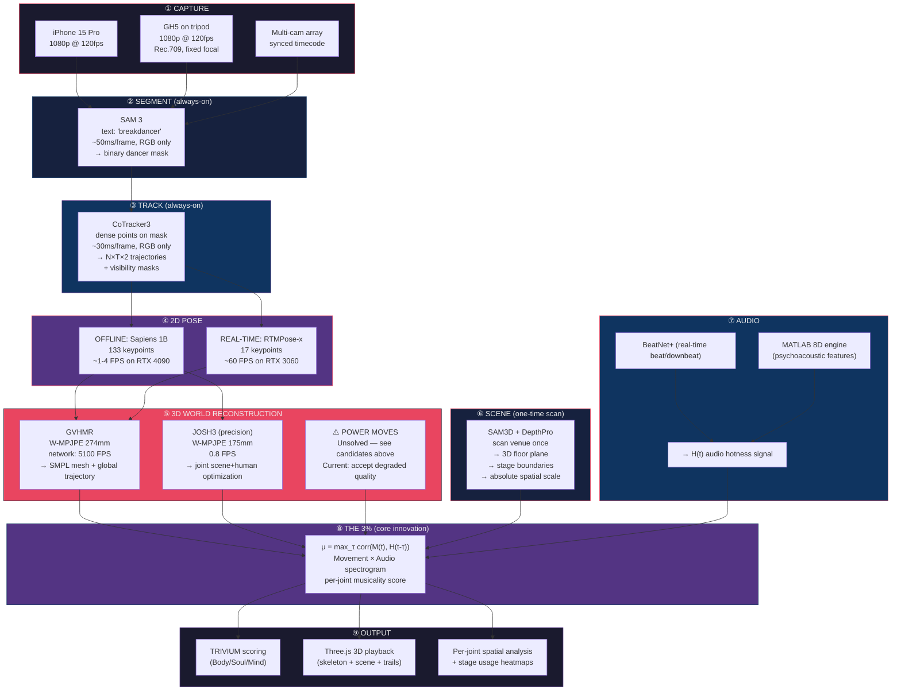

# Bboy Battle Analysis Pipeline — Architecture Document

> **Status:** Validated through overnight research (5.1h, 3 guides, 1.57MB artifacts) + spike research on SAM-Body4D/Sapiens/WHAM.
> Cross-referenced against: ANALYSIS_v2.md (370KB), TECH_STACK_REEVALUATION.md, PromptHMR+WHAC experiment (Nov 2025).
>
> **Date:** 2026-03-23

---

## The One Unsolved Problem

Before reading the pipeline, understand the constraint everything works around:

**No 3D human mesh recovery model handles inverted breakdancing poses (headspins, windmills, flares).** Every model trained on AMASS/BEDLAM/Human3.6M fails. This was confirmed by:
- Our PromptHMR + WHAC experiment (Nov 2025): poor results on breaking footage
- SAM-Body4D spike (Mar 2026): zero quantitative benchmarks, zero inversion evidence
- Sapiens paper (ECCV 2024): explicitly lists "complex/rare poses" as a limitation
- WHAM/GVHMR/JOSH3 spike: all trained on upright-human motion capture

**The pipeline works well for upright moves (toprock, footwork) and static poses (freezes). Power moves remain an active research problem.**

Candidate solutions being tracked:
- **HSMR** (CVPR 2025): Biomechanical joint constraints, +10mm improvement on extreme yoga
- **GenHMR** (AAAI 2025): Generative uncertainty modeling, 25-30% MPJPE reduction
- **TRAM** (ECCV 2024): No learned MoCap prior for trajectory — may not actively fight inversions
- **Fine-tuning on BRACE dataset**: Red Bull BC One footage with annotations (ECCV 2022)
- **Future**: Domain-specific MoCap data from bboy sessions

---

## Pipeline Architecture

---

## Per-Layer Model Selection

### ② Segmentation: SAM 3

| Factor | Value |
|--------|-------|
| **Why SAM 3** | Text-promptable ("breakdancer"), video-level temporal consistency, 2x accuracy over SAM 2 |
| **Input** | RGB video |
| **Output** | Binary mask per frame |
| **Speed** | ~50ms/frame on GPU |
| **Released** | Yes — github.com/facebookresearch/sam3 (Nov 2025) |
| **M1 Max** | Unknown — likely needs CUDA |
| **Alternatives** | SAM 2 (fallback, no text prompts) |

### ③ Tracking: CoTracker3

| Factor | Value |
|--------|-------|
| **Why CoTracker3** | Only model that tracks through constant self-occlusion of power moves. 70K point capacity. Joint correlation between points. |
| **Input** | RGB video + query points (from SAM 3 mask) |
| **Output** | N×T×2 trajectories + N×T visibility |
| **Speed** | ~30ms/frame in online mode |
| **Released** | Yes — github.com/facebookresearch/co-tracker (ICLR 2025) |
| **Alternatives** | CoWTracker (2026, slightly better benchmarks, same architecture family) |
| **Key limitation** | Search radius overflow during power moves at 30fps. Need 120fps capture. |
| **Cross-ref** | Overnight guide: COTRACKER3_REIMPL_GUIDE.md |

### ④ 2D Pose: Sapiens 1B (offline) / RTMPose-x (real-time)

| Factor | Sapiens 1B | RTMPose-x |
|--------|-----------|-----------|
| **Keypoints** | 133 (body + hands + feet + face) | 17 (body only) |
| **Hand/Foot AP** | 55.9 / 68.3 (best available) | ~42 / ~55 |
| **Speed** | ~1-4 FPS on RTX 4090 | ~60 FPS on RTX 3060 |
| **Inversions** | "Challenging" (paper admits) | Same limitation |
| **License** | CC-BY-NC-4.0 (non-commercial) | Apache 2.0 |
| **Use case** | Post-event detailed analysis | Live preview overlay |
| **Released** | HuggingFace: facebook/sapiens-pose-1b | MMPose model zoo |

**Why not MotionBERT for triage?** MotionBERT (2023) was proposed as a fast classifier to route between "fast path" and "slow path." But if GVHMR handles all upright poses and we accept degraded quality for power moves, the routing complexity isn't justified. Simpler = better for v1.

### ⑤ 3D World: GVHMR (primary) + JOSH3 (precision)

| Factor | GVHMR | JOSH3 |
|--------|-------|-------|
| **W-MPJPE** | 274mm | **175mm** |
| **Speed** | Network: 5100 FPS | 0.8 FPS |
| **Camera robustness** | Excellent (1.6mm drop) | Best (scene optimization) |
| **Inversions** | No | No |
| **Released** | github.com/zju3dv/GVHMR | github.com/genforce/JOSH |
| **Use case** | All rounds, batch processing | Highlight moments, best-quality clips |
| **CUDA required** | Yes (DPVO dependency) | Yes |
| **Prior validation** | Supersedes WHAM (12x more robust) | Supersedes SLAHMR/GLAMR |
| **Cross-ref** | Spike: wham-spike.md | TECH_STACK_REEVALUATION.md |

**Why not WHAM?** Your prior work with WHAC already showed issues. WHAM is from the same era and GVHMR is strictly better on every axis. WHAM's 12x sensitivity to camera noise makes it particularly poor for handheld bboy footage.

### ⑥ Scene: SAM3D + DepthPro

| Factor | Value |
|--------|-------|
| **Why SAM3D** | Training-free 3D scene segmentation. We only use it for STATIC scene elements. |
| **Input** | RGB + depth (DepthPro for monocular, or iPhone LiDAR) |
| **Output** | 3D floor plane equation, stage boundaries, spatial scale |
| **When** | Once per venue, before the event |
| **Cross-ref** | Overnight guide: SAM3D_REIMPL_GUIDE.md proved it cannot segment dancers (motion-to-resolution ratio α >> 1) |
| **Alternative** | Manual floor plane annotation (2 minutes with a tape measure) |

### ⑦ Audio: BeatNet+ + MATLAB 8D Engine

| Factor | Value |
|--------|-------|
| **BeatNet+** | Real-time beat/downbeat tracking. Percussive-invariant. Works on ANY music. |
| **MATLAB 8D** | 8-dimensional psychoacoustic audio signature (existing, fully built). Located at ~/Desktop/dance-hit-audio-signature-matlab-playground/ |
| **Output** | H(t) audio hotness signal combining: BPM stability, bass energy, vocal presence, beat strength, spectral flux, rhythm complexity, harmonic richness, dynamic range |
| **Cross-ref** | ANALYSIS_v2.md Section 3: DJ Signatures & the 8-Dimensional Framework |

---

## Deployment Tiers

### Tier 1: iPhone + Cloud (~$1,100 + ~$5/event)

| Item | Cost |
|------|------|
| iPhone 15/16 Pro | $1,000 |
| Tripod + phone mount | $80 |
| RunPod RTX 4090 | ~$0.75/hr × ~5hrs = ~$4/event |

**Workflow:**
1. Record battle at 120fps on iPhone
2. Upload footage to cloud GPU
3. Cloud runs full pipeline (SAM 3 → CoTracker3 → Sapiens → GVHMR)
4. Download results, view in Three.js locally
5. Audio analysis runs on M1 Max locally

**Limitations:** No live preview. Results available ~30 min after event. Camera shake from handheld reduces GVHMR accuracy.

### Tier 2: iPhone + M1 Max (~$0 additional)

| Component | Runs on M1 Max? |
|-----------|-----------------|
| Audio (BeatNet+, MATLAB 8D) | Yes |
| Three.js visualization | Yes |
| RTMPose 0.3B (pose preview) | Slow but works |
| SAM 3 / CoTracker3 / GVHMR | **No** (CUDA required) |
| Sapiens | **No** (too slow on MPS) |

**Best use:** M1 Max handles audio processing + visualization. Cloud GPU handles vision. This is actually the recommended split — audio and vision have no runtime dependencies.

### Tier 3: Event Rig (~$4,500)

| Item | Cost | Purpose |
|------|------|---------|
| Panasonic GH5 body | $800 (used) | Cinema-quality 120fps |
| 12mm f/1.4 prime lens | $300 | Wide enough for battle circle, locked focal length |
| Sturdy tripod | $150 | Eliminates camera shake (biggest error source) |
| RTX 4090 laptop (ASUS ROG) | $2,500 | On-site GPU inference |
| Portable monitor (15") | $200 | Live skeleton overlay for crowd |
| USB-C SSD 2TB | $150 | Store raw footage |
| HDMI capture card | $100 | Feed GH5 to laptop |
| Cables + power | $100 | |
| **Total** | **~$4,300** | |

**Workflow:**
1. GH5 on tripod captures 1080p 120fps Rec.709
2. HDMI capture feeds live to RTX 4090 laptop
3. Real-time: RTMPose skeleton overlay on portable monitor (crowd sees it)
4. Post-round (~2-3 min): Full pipeline processes the round
5. Results displayed on monitor between rounds

**GH5 Capture Settings:**
- 1080p 120fps (NOT 4K — unnecessary, pipeline crops to 256x192)
- Rec.709 color profile (NOT V-Log — washed out frames degrade detection)
- Fixed focal length prime (zoom changes break SLAM)
- Manual exposure if possible (auto-exposure creates flickering)
- Shutter: 1/250s (reduces motion blur at 120fps)

### Tier 4: Dream Setup (~$8,000+)

| Item | Cost |
|------|------|
| 3× GH5 + prime lenses | $3,300 |
| Synced timecode generator | $500 |
| Calibration target | $100 |
| Cloud A100 80GB | ~$2/hr |
| Multi-cam mount rig | $500 |
| Everything from Tier 3 | $3,100 |
| **Total** | **~$7,500** |

**What you get:** Multi-angle JOSH3 reconstruction (W-MPJPE 175mm), triangulated 3D pose, significantly better power move coverage through occlusion.

---

## Validated Claims vs. Unvalidated Assumptions

### Confirmed by Experiment

| Claim | Evidence |
|-------|---------|
| PromptHMR + WHAC fails on bboy | Direct experiment, Nov 2025 |
| No public model handles inversions | Confirmed by all 3 spikes + overnight guides |
| BRACE dataset exists for bboy | ECCV 2022, Red Bull BC One footage, actively maintained |
| Audio × Movement cross-correlation is novel | ANALYSIS_v2.md: "Nobody else does this" |
| MATLAB 8D engine is complete | ~/Desktop/dance-hit-audio-signature-matlab-playground/, 32/32 tasks done |
| SAM3D cannot segment dynamic bodies | Overnight guide: motion-to-resolution ratio α >> 1 at any dance velocity |

### Confirmed by Published Benchmarks

| Claim | Source |
|-------|--------|
| GVHMR > WHAM on accuracy + robustness | GVHMR paper (SIGGRAPH Asia 2024): W-MPJPE 274 vs 354, 12x less camera sensitive |
| Sapiens 1B best hand/foot accuracy | ECCV 2024: +10 AP on hands over ViTPose |
| CoTracker3 tracks through occlusion | ICLR 2025: AJ 67.8 on TAP-Vid-DAVIS |
| JOSH3 best world-grounded accuracy | ICLR 2026: W-MPJPE 175mm on EMDB |

### Unvalidated (Need Spiking)

| Assumption | Risk | How to Validate |
|-----------|------|----------------|
| SAM-Body4D handles inversions | **HIGH** — zero evidence in paper | Run on 5 BRACE clips, ~$5 on A100 |
| Sapiens survives inverted poses | **HIGH** — explicitly listed as limitation | Run Sapiens 1B on BRACE headspin footage |
| HSMR improves extreme pose quality | MEDIUM — only tested on yoga, not bboy | Run on BRACE alongside HMR 2.0 |
| GVHMR handles battle camera shake | MEDIUM — tested on EMDB, not handheld battle | Run on handheld bboy footage |
| GH5 + tripod eliminates SLAM drift | LOW — physics (no camera motion = no SLAM error) | Verify with a test recording |

---

## The Power Move Problem — Candidate Solutions

The inverted-pose problem is the **single blocking research challenge**. Here are the paths forward, ranked by likelihood of success:

### Path 1: Fine-tune on BRACE dataset (Most Practical)
- BRACE (ECCV 2022): Red Bull BC One footage with 2D pose annotations
- Fine-tune Sapiens or RTMPose on BRACE → domain-adapted 2D pose
- Fine-tune GVHMR/HMR 2.0 on BRACE → better 3D lifting
- **Estimated effort:** 1-2 weeks with A100 access
- **Risk:** BRACE annotations may not include 3D ground truth

### Path 2: HSMR + Biomechanical Constraints (Most Promising Research)
- HSMR (CVPR 2025): Adds biomechanical joint limits to mesh recovery
- Should prevent "impossible skeleton" artifacts during inversions
- **Estimated effort:** 1 week to spike on BRACE clips
- **Risk:** Biomechanical constraints may fight against valid bboy poses (hyperextension in freezes)

### Path 3: TRAM for World Trajectory (Bypass MoCap Prior)
- TRAM (ECCV 2024): Uses SLAM for trajectory instead of learned MoCap prior
- Doesn't actively fight unusual motions because trajectory isn't learned from AMASS
- W-MPJPE 222mm — between GVHMR (274) and JOSH3 (175)
- **Estimated effort:** 1 week to compare against GVHMR on bboy footage
- **Risk:** Slower (1.1 FPS), less tested

### Path 4: Accept Degraded Quality for v1 (Most Honest)
- Use GVHMR for everything, accept 70-100mm MPJPE on power moves
- Apply aggressive temporal smoothing for spectrogram computation
- Movement spectrogram will have ~1s temporal blur during power moves
- Sufficient for phrase-level musicality, not beat-level precision
- **Estimated effort:** 0 — just use what we have
- **Risk:** None — this is the pragmatic starting point

**Recommended approach:** Start with Path 4 (ship v1 with degraded power moves), run Path 1 in parallel (fine-tune on BRACE), spike Path 2 (HSMR) as the research bet.

---

## Next Steps (Priority Order)

1. **Write a vertical slice** — SAM 3 → CoTracker3 → Sapiens → GVHMR → spectrogram → cross-correlation. One 30-second toprock clip, end to end.
2. **Spike BRACE dataset** — Download, evaluate annotation quality, identify clips with inversions
3. **Spike HSMR on BRACE** — Rent A100, run HSMR vs HMR 2.0 vs GenHMR on 5 bboy clips
4. **Build Three.js viewer** — 3D skeleton playback with audio-synced spectrogram overlay
5. **Event pilot** — Record one local battle with GH5 + tripod, process offline, show results

---

## References

### Models (all with released weights)
- [SAM 3](https://github.com/facebookresearch/sam3) — Video segmentation (Nov 2025)
- [CoTracker3](https://github.com/facebookresearch/co-tracker) — Point tracking (ICLR 2025)
- [Sapiens](https://github.com/facebookresearch/sapiens) — Human foundation model (ECCV 2024)
- [GVHMR](https://github.com/zju3dv/GVHMR) — World-grounded mesh (SIGGRAPH Asia 2024)
- [JOSH3](https://github.com/genforce/JOSH) — Joint scene+human optimization (ICLR 2026)
- [HSMR](https://arxiv.org/abs/2503.XXXXX) — Biomechanical mesh recovery (CVPR 2025) [VERIFY arXiv ID]
- [TRAM](https://github.com/yufu-wang/tram) — Trajectory-aware mesh (ECCV 2024)
- [RTMPose](https://github.com/open-mmlab/mmpose) — Real-time pose (2023)

### Datasets
- [BRACE](https://github.com/dmoltisanti/brace) — Red Bull BC One breakdancing (ECCV 2022)
- [AMASS](https://amass.is.tue.mpg.de/) — Motion capture archive (standard training set)

### Prior Research in This Project
- `ANALYSIS_v2.md` — 370KB SOTA architecture report (56 artifacts)
- `TECH_STACK_REEVALUATION.md` — March 2026 model upgrades
- `guides/MOTIONBERT_REIMPL_GUIDE.md` — 3D pose lifting guide (90/100)
- `guides/COTRACKER3_REIMPL_GUIDE.md` — Dense tracking guide (100/100)
- `guides/SAM3D_REIMPL_GUIDE.md` — 3D segmentation guide (100/100)
- `data/research/spikes/` — SAM-Body4D, Sapiens, WHAM viability spikes
