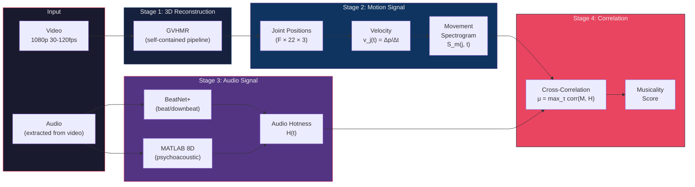

# Proof of Concept: Bboy Battle Musicality Analysis

> **Version:** v0.1 POC
> **Date:** 2026-03-23
> **Prerequisites:** None — this document is self-contained.

---

## 1. What We're Proving

### Hypothesis

> **It is possible to compute a meaningful musicality score from a single monocular video of a breakdancer by cross-correlating per-joint velocity signals with audio beat structure.**

Formally: given video $V$ and audio $A$, we compute:

$$\mu = \max_\tau \text{corr}\left(\sum_j \|\dot{p}_j(t)\|,\ H(t - \tau)\right)$$

where $\dot{p}_j(t)$ is the 3D velocity of joint $j$ at time $t$, and $H(t)$ is the audio "hotness" signal from the 8D psychoacoustic engine.

If $\mu > 0.3$ on beat-aligned toprock and $\mu < 0.15$ on deliberately off-beat movement, the system has discriminative power. **Nobody else computes this cross-correlation. This is the 3%.**

### Why This Matters

Current bboy judging is 100% subjective. A validated musicality score would be the first quantitative, reproducible component of breaking analysis. The POC proves the math works before we invest in the full ARC-101 pipeline.

---

## 2. What the POC Does and Doesn't Do

| Capability | POC v0.1 | Full System |
|-----------|----------|-------------|
| **Camera motion estimation** | YES — GVHMR runs visual odometry internally | YES — MASt3R-SLAM |
| **Person detection + tracking** | YES — GVHMR's built-in YOLOv8 + ViTPose | YES — SAM 3 text-prompted |
| **3D human mesh recovery** | YES — SMPL mesh in world coordinates | YES — SKEL biomechanical model |
| **World-grounded trajectory** | YES — gravity-view coordinates (GVHMR) | YES — metric-scale SLAM + contact |
| **3D scene reconstruction** | NO — not needed for musicality | YES — SAM3D + MASt3R for venue |
| **Camera LiDAR/gyroscope** | NO — monocular RGB only | YES — iPhone LiDAR for depth, gyro for gravity |
| **Dense point tracking** | NO — skeleton joints only | YES — CoTracker3 for surface tracking |
| **Biomechanical constraints** | NO — standard SMPL ball joints | YES — SKEL + HSMR anatomical limits |
| **Audio analysis** | YES — BeatNet+ or MATLAB 8D | YES — full 8D psychoacoustic engine |
| **Musicality scoring** | YES — audio-motion cross-correlation | YES — per-round TRIVIUM scoring |
| **Real-time display** | NO — offline batch processing | YES — RTMPose live overlay |
| **3D playback** | BASIC — matplotlib skeleton plot | FULL — Three.js with scene + trails |
| **Power moves (inversions)** | DEGRADED — GVHMR fails on headspins | IMPROVED — HSMR + DPoser-X + fine-tuning |

### What "World-Grounded" Means in the POC

GVHMR reconstructs the dancer's 3D motion in a **gravity-view (GV) coordinate system**:

$$R_{c \to gv} = \begin{bmatrix} (\hat{y} \times \hat{v})^T \\ \hat{g}^T \\ ((\hat{y} \times \hat{v}) \times \hat{g})^T \end{bmatrix}$$

where $\hat{g}$ is gravity direction (estimated from visual odometry), $\hat{v}$ is camera view direction.

This means:
- **Y-axis = gravity** — the dancer stays "upright" regardless of camera tilt
- **Translation = world meters** — the dancer's position is in real-world scale
- **No scene model needed** — gravity anchors the coordinate system without reconstructing the floor

We do NOT reconstruct the 3D venue, floor plane, or stage boundaries in the POC. That comes in v0.5 with SAM3D.

---

## 3. Methodology

### 3.1 Overview



### 3.2 Stage 1: 3D Human Reconstruction (GVHMR)

**Input:** MP4 video file (any resolution, any frame rate).

**What GVHMR does internally** (we don't need to implement any of this):

1. **Person detection** — YOLOv8x detects bounding boxes per frame
2. **Single-person tracking** — selects the most prominent person, smooths bounding boxes
3. **2D pose estimation** — ViTPose-H extracts COCO-17 keypoints per frame
4. **Visual feature extraction** — ViT backbone encodes appearance context
5. **Camera motion** — SimpleVO (SIFT-based) estimates camera rotation between frames
6. **World-grounded mesh** — GVHMR network predicts SMPL parameters in gravity-view coordinates

**Output:** PyTorch `.pt` file containing:
```
smpl_params_global:
  global_orient: (F, 3)     # axis-angle root rotation in world frame
  body_pose:     (F, 63)    # 21 joints × 3 axis-angle
  betas:         (F, 10)    # body shape
  transl:        (F, 3)     # root translation in METERS
```

**To get joint positions** (5 lines of Python):
```python
import smplx
body_model = smplx.create(model_path, model_type="smplx")
output = body_model(**smpl_params_global)
joints_3d = output.joints  # (F, J, 3) in world coordinates (meters)
```

### 3.3 Stage 2: Movement Spectrogram

**Step 1: Per-joint velocity via central differences**

$$v_j(t) = \frac{p_j(t+1) - p_j(t-1)}{2 \Delta t}$$

where $\Delta t = 1/\text{fps}$.

**Step 2: Savitzky-Golay smoothing** (suppress noise from GVHMR's ~57mm MPJPE)

$$\tilde{v}_j(t) = \text{SG}(v_j, \text{window}=31, \text{order}=3)$$

At 30fps with window=31: effective cutoff ~2.9 Hz. This preserves move-level rhythm but destroys within-beat dynamics. Acceptable for POC.

**Step 3: Total movement energy**

$$M(t) = \sum_{j=1}^{J} \|\tilde{v}_j(t)\|_2$$

This single scalar time series is the "movement spectrogram" collapsed to its energy envelope. The full spectrogram (per-joint, per-frequency) comes in v0.5.

**Expected velocity noise analysis:**

| Condition | GVHMR MPJPE | Velocity noise $\sigma_v$ | Dance velocity | SNR |
|-----------|-------------|--------------------------|----------------|-----|
| Toprock (upright) | ~57mm | ~2.4 m/s raw | 1-3 m/s | ~1:1 raw |
| Toprock (smoothed) | ~10mm effective | ~0.42 m/s | 1-3 m/s | **~5:1** |
| Footwork | ~65mm | ~2.7 m/s raw | 2-5 m/s | ~1.5:1 raw |
| Power moves | ~85mm+ | ~3.6 m/s raw | 2-5 m/s | ~1:1 |

**SNR > 3:1 after smoothing is required for meaningful correlation.** The POC targets toprock/footwork where this is achievable.

### 3.4 Stage 3: Audio Signal

**Option A (simple — BeatNet+ only):**

Extract beat positions $\{b_k\}$ from the audio. Construct a beat impulse train:

$$H_{\text{simple}}(t) = \sum_k \delta(t - b_k)$$

Convolve with a Gaussian kernel ($\sigma = 50$ ms) to create a smooth audio hotness signal.

**Option B (full — MATLAB 8D engine):**

Run the existing `analyze_track.py` from `~/Desktop/dance-hit-audio-signature-matlab-playground/`. This produces the 8-dimensional psychoacoustic signature per audio segment:

$$H(t) = \sum_{i=1}^{8} w_i D_i(t)$$

where $D_i$ are: BPM stability, bass energy, vocal presence, beat strength, spectral flux, rhythm complexity, harmonic richness, dynamic range.

**For the POC, Option A is sufficient.** It tests whether the cross-correlation works at all.

### 3.5 Stage 4: Audio-Motion Cross-Correlation

$$C(\tau) = \frac{\sum_t (M(t) - \bar{M})(H(t + \tau) - \bar{H})}{\sqrt{\sum_t (M(t) - \bar{M})^2 \cdot \sum_t (H(t + \tau) - \bar{H})^2}}$$

The musicality score is:

$$\mu = \max_\tau C(\tau) \quad \text{for } \tau \in [-200\text{ms}, +200\text{ms}]$$

And the optimal lag:

$$\tau^* = \arg\max_\tau C(\tau)$$

**Interpretation:**
- $\mu > 0.4$: Strong musicality (dancer hits beats consistently)
- $0.2 < \mu < 0.4$: Moderate musicality
- $\mu < 0.2$: Weak or no musicality
- $\tau^* < 0$: Dancer **anticipates** beats (elite skill)
- $\tau^* > 0$: Dancer **reacts** to beats (typical)
- $\tau^* \approx 0$: Dancer is perfectly on the beat

---

## 4. Tech Stack

### 4.1 POC Stack (What Actually Runs)

| Component | Model/Tool | Version | License | GPU Required |
|-----------|-----------|---------|---------|-------------|
| 3D Reconstruction | GVHMR | SIGGRAPH Asia 2024 | Research | Yes (CUDA) |
| Body Model | SMPLX | Latest | Research (MPI registration) | No |
| Beat Detection | BeatNet+ | Dec 2024 | Open | No (CPU) |
| Audio Features | analyze_track.py (existing) | Complete | Own | No (MATLAB/Python) |
| Cross-Correlation | NumPy/SciPy | Standard | BSD | No |
| Visualization | matplotlib + basic Three.js | Standard | BSD/MIT | No |

### 4.2 Your Hardware: M1 Max / 32GB RAM

| Task | Runs on M1 Max? | Notes |
|------|-----------------|-------|
| GVHMR inference | **NO** | CUDA required (DPVO, pytorch3d) |
| SMPL forward kinematics | YES | Pure PyTorch, MPS works |
| Audio analysis (BeatNet+) | YES | CPU-based |
| MATLAB 8D engine | YES | MATLAB runs natively |
| Cross-correlation (NumPy) | YES | CPU-based |
| Three.js visualization | YES | Browser-based |
| Video preprocessing (ffmpeg) | YES | Native |

**Workflow split:**
```
Cloud GPU (RunPod/Lightning AI):     M1 Max (local):
├── GVHMR inference                  ├── Audio analysis
├── SMPL joint extraction            ├── Cross-correlation
└── Output: joints_3d.npy            ├── Visualization
                                     └── Score computation
    ↓ download (~5MB per clip)           ↑
    └────────────────────────────────────┘
```

### 4.3 Cloud GPU Options

| Provider | GPU | VRAM | Cost/hr | Recommended? |
|----------|-----|------|---------|-------------|
| **Lightning AI** | A10G | 24GB | Free tier available | **YES — start here** |
| RunPod | RTX 4090 | 24GB | $0.74/hr | Yes — fastest |
| Lambda | A100 80GB | 80GB | $1.29/hr | Overkill for POC |
| Google Colab | T4/A100 | 16-40GB | Free-$10/mo | Possible but unreliable |

**Lightning AI is the recommended starting point** — free GPU tier, Jupyter notebooks, persistent storage.

### 4.4 Real-Time Stack (Future — v0.5+)

For live display at events, the stack changes significantly:

```
┌─────────────────────────────────────────────────┐
│  CAPTURE DEVICE                                 │
│                                                 │
│  iPhone 15/16 Pro                               │
│  ├── 120fps video capture                       │
│  ├── LiDAR depth @ 30fps (up to 5m range)      │
│  │   → Provides metric depth WITHOUT MDE        │
│  │   → Eliminates DepthPro dependency           │
│  │   → 2cm accuracy at 2m (vs 14cm from MDE)   │
│  ├── Gyroscope @ 100Hz                          │
│  │   → Provides EXACT gravity direction         │
│  │   → Eliminates visual odometry for gravity   │
│  │   → GVHMR showed only 1.6mm penalty vs gyro │
│  │   → With actual gyro: 0mm penalty!           │
│  └── Accelerometer @ 100Hz                      │
│      → Camera shake detection                   │
│      → Can gate "trustworthy" vs "shaky" frames │
└───────────────┬─────────────────────────────────┘
                │ USB-C / WiFi stream
                ▼
┌─────────────────────────────────────────────────┐
│  EDGE COMPUTE (RTX 4090 laptop at venue)        │
│                                                 │
│  REAL-TIME PATH (~7 FPS):                       │
│  ├── RTMPose-x (2D keypoints, ~16ms/frame)     │
│  ├── Skeleton overlay on monitor (crowd sees)   │
│  └── Beat sync indicator (audio-only, CPU)      │
│                                                 │
│  NEAR-REAL-TIME PATH (~3 FPS, 1-2s delay):     │
│  ├── GVHMR (world-grounded SMPL)               │
│  │   └── Uses iPhone gyro for gravity           │
│  │       (skip visual odometry entirely!)       │
│  ├── Joint velocity extraction                  │
│  └── Live musicality meter (rolling 5s window)  │
│                                                 │
│  POST-ROUND PATH (2-3 min after round ends):   │
│  ├── Full GVHMR reprocessing with all frames   │
│  ├── JOSH3 refinement on highlight segments     │
│  ├── Complete audio-motion cross-correlation    │
│  └── TRIVIUM score display on screen            │
└─────────────────────────────────────────────────┘
```

**Why LiDAR + Gyroscope change everything:**

| Sensor | What it replaces | Improvement |
|--------|-----------------|-------------|
| **LiDAR** | DepthPro monocular depth estimation | 2cm accuracy vs 14cm — 7x better |
| **LiDAR** | SLAM metric scale estimation | Direct metric depth, no scale ambiguity |
| **Gyroscope** | Visual odometry for gravity direction | Exact gravity, no 1.6mm penalty |
| **Gyroscope** | Camera shake detection | Can flag unreliable frames in real-time |
| **Accelerometer** | Nothing (new capability) | Detect camera bumps, gate processing |

The iPhone Pro is essentially a **calibrated sensor array** (RGB + depth + IMU) disguised as a phone. For the full system, it's the ideal capture device because it provides exactly the auxiliary signals that eliminate the biggest error sources in monocular reconstruction.

---

## 5. Step-by-Step Instructions

### Prerequisites

```bash
# On cloud GPU (Lightning AI or RunPod):
conda create -n bboy-poc python=3.10
conda activate bboy-poc
conda install pytorch torchvision pytorch-cuda=12.1 -c pytorch -c nvidia

# Clone GVHMR
git clone https://github.com/zju3dv/GVHMR && cd GVHMR
pip install -r requirements.txt
pip install -e .

# Download checkpoints (5 models)
# Follow GVHMR README for checkpoint download links

# Register for SMPL body model:
# 1. Go to https://smplx.is.tue.mpg.de/
# 2. Create account, agree to license
# 3. Download SMPLX_NEUTRAL.npz
# 4. Place in inputs/checkpoints/body_models/smplx/
```

### Step 1: Get a Test Video

```bash
# Option A: Download a BRACE dataset clip (Red Bull BC One)
# Follow https://github.com/dmoltisanti/brace for download instructions

# Option B: Record 30 seconds of toprock with your iPhone
# - Hold phone horizontally, relatively stable
# - Record someone doing basic toprock to music
# - Transfer video to cloud GPU

# Option C: Use a YouTube bboy clip (for testing only)
yt-dlp -f 'best[height<=1080]' "https://youtube.com/watch?v=EXAMPLE" -o test_clip.mp4
```

### Step 2: Run GVHMR

```bash
# For handheld camera (typical):
python tools/demo/demo.py --video=test_clip.mp4

# For tripod/static camera (better — skips visual odometry):
python tools/demo/demo.py --video=test_clip.mp4 -s

# Output appears in:
#   outputs/demo/test_clip/
#   ├── hmr4d_results.pt      ← SMPL params (what we need)
#   ├── incam_global.mp4      ← rendered mesh overlay video
#   └── ... (intermediate cached files)
```

**Expected runtime:** ~2-5 minutes for a 30-second clip at 30fps on RTX 4090.

### Step 3: Extract Joint Positions

```python
# extract_joints.py — run on cloud GPU or download .pt and run locally
import torch
import smplx
import numpy as np

# Load GVHMR output
results = torch.load("outputs/demo/test_clip/hmr4d_results.pt")
params = results["smpl_params_global"]

# Load SMPL body model
body_model = smplx.create(
    "inputs/checkpoints/body_models",
    model_type="smplx",
    gender="neutral",
    batch_size=params["body_pose"].shape[0]
)

# Forward kinematics → joint positions in world coordinates
with torch.no_grad():
    output = body_model(
        global_orient=params["global_orient"],
        body_pose=params["body_pose"],
        betas=params["betas"],
        transl=params["transl"]
    )

joints_3d = output.joints.numpy()  # (F, J, 3) in meters
np.save("joints_3d.npy", joints_3d)
print(f"Extracted {joints_3d.shape[0]} frames, {joints_3d.shape[1]} joints")
# Download joints_3d.npy (~5MB) to M1 Max
```

### Step 4: Compute Movement Signal (on M1 Max)

```python
# movement_signal.py
import numpy as np
from scipy.signal import savgol_filter

joints_3d = np.load("joints_3d.npy")  # (F, J, 3)
fps = 30  # adjust to your video's frame rate

# Central difference velocity
velocity = (joints_3d[2:] - joints_3d[:-2]) / (2.0 / fps)  # (F-2, J, 3)

# Per-joint speed (magnitude)
speed = np.linalg.norm(velocity, axis=-1)  # (F-2, J)

# Savitzky-Golay smoothing per joint
speed_smooth = np.zeros_like(speed)
for j in range(speed.shape[1]):
    speed_smooth[:, j] = savgol_filter(speed[:, j], window_length=31, polyorder=3)

# Total movement energy
M = speed_smooth.sum(axis=1)  # (F-2,)

# Normalize
M = (M - M.mean()) / (M.std() + 1e-8)

np.save("movement_signal.npy", M)
print(f"Movement signal: {len(M)} samples at {fps} Hz")
```

### Step 5: Extract Audio Beat Signal (on M1 Max)

```python
# audio_signal.py
import subprocess
import numpy as np
from scipy.signal import windows

# Extract audio from video
subprocess.run(["ffmpeg", "-i", "test_clip.mp4", "-vn", "-ar", "44100", "-ac", "1", "audio.wav", "-y"])

# Option A: Simple onset detection (no BeatNet+ dependency)
import librosa
y, sr = librosa.load("audio.wav", sr=44100)
onset_env = librosa.onset.onset_strength(y=y, sr=sr, hop_length=512)
beat_times = librosa.frames_to_time(
    librosa.onset.onset_detect(onset_envelope=onset_env, sr=sr, hop_length=512),
    sr=sr, hop_length=512
)

# Create smooth beat signal at video frame rate
fps = 30
n_frames = len(np.load("movement_signal.npy"))
H = np.zeros(n_frames)

sigma_ms = 50  # 50ms Gaussian spread
sigma_frames = sigma_ms / 1000.0 * fps

for b in beat_times:
    frame_idx = int(b * fps)
    if 0 <= frame_idx < n_frames:
        # Gaussian impulse at each beat
        t = np.arange(n_frames)
        H += np.exp(-0.5 * ((t - frame_idx) / sigma_frames) ** 2)

# Normalize
H = (H - H.mean()) / (H.std() + 1e-8)

np.save("audio_signal.npy", H)
print(f"Audio signal: {len(H)} samples, {len(beat_times)} beats detected")
```

### Step 6: Compute Musicality Score (on M1 Max)

```python
# musicality.py
import numpy as np
from scipy.signal import correlate

M = np.load("movement_signal.npy")
H = np.load("audio_signal.npy")

# Ensure same length
n = min(len(M), len(H))
M, H = M[:n], H[:n]

fps = 30
max_lag_ms = 200
max_lag_frames = int(max_lag_ms / 1000.0 * fps)

# Normalized cross-correlation
corr = correlate(M, H, mode='full')
corr /= (np.sqrt(np.sum(M**2) * np.sum(H**2)) + 1e-8)

# Extract the ±200ms window
mid = len(corr) // 2
window = corr[mid - max_lag_frames : mid + max_lag_frames + 1]
lags_ms = np.arange(-max_lag_frames, max_lag_frames + 1) * (1000.0 / fps)

# Musicality score
mu = np.max(window)
tau_star_ms = lags_ms[np.argmax(window)]

print(f"\n{'='*50}")
print(f"  MUSICALITY SCORE")
print(f"{'='*50}")
print(f"  μ = {mu:.3f}")
print(f"  τ* = {tau_star_ms:.0f} ms")
print(f"")
if mu > 0.4:
    print(f"  → STRONG musicality (dancer hits beats consistently)")
elif mu > 0.2:
    print(f"  → MODERATE musicality")
else:
    print(f"  → WEAK or no detectable musicality")
print(f"")
if tau_star_ms < -30:
    print(f"  → Dancer ANTICIPATES beats by {abs(tau_star_ms):.0f}ms (elite)")
elif tau_star_ms > 30:
    print(f"  → Dancer REACTS to beats with {tau_star_ms:.0f}ms delay")
else:
    print(f"  → Dancer is ON the beat (±30ms)")
print(f"{'='*50}")
```

---

## 6. Expected Results

### Success Criteria

| Test Case | Expected μ | Expected τ* | Validates |
|-----------|-----------|-------------|-----------|
| Toprock on beat | > 0.3 | -50 to +100ms | Basic cross-correlation works |
| Toprock deliberately off-beat | < 0.15 | Random | Discriminative power |
| Footwork on beat | > 0.2 | -50 to +150ms | Works beyond toprock |
| Power moves | < 0.2 (noisy) | Unreliable | Confirms the SNR limitation |
| Silent video (no music) | ~0.0 | Random | Null hypothesis |

### What "Failure" Looks Like

- μ ≈ 0.0 for all test cases → velocity signal too noisy (GVHMR MPJPE too high)
- μ > 0.3 for off-beat dancing → cross-correlation is spurious (correlating with periodicity, not musicality)
- τ* consistently > 500ms → temporal alignment is wrong (fps mismatch or audio sync issue)

### What to Measure

1. **Per-joint velocity SNR** — compute $\text{SNR}_j = \bar{v}_j / \sigma_{noise}$ for each joint
2. **Optimal smoothing window** — sweep SG window from 5 to 61, find best μ
3. **Per-joint musicality** — compute μ separately for arms, legs, torso — which body parts drive musicality?

---

## 7. Hardware Requirements

| Component | Minimum | Recommended |
|-----------|---------|-------------|
| **Cloud GPU** | T4 16GB (slow) | RTX 4090 24GB or A10G 24GB |
| **Local machine** | Any with Python 3.10 | M1 Max / 32GB (your machine) |
| **Storage** | ~10GB (models + checkpoints) | 20GB |
| **Network** | Upload video, download ~5MB results | Same |

---

## 8. Cost Estimate

| Item | Cost |
|------|------|
| Lightning AI free tier (A10G) | $0 |
| OR RunPod RTX 4090 × 2 hours | $1.50 |
| SMPL registration | $0 (free academic) |
| Test video (record yourself) | $0 |
| **Total** | **$0 - $1.50** |

---

## 9. What Comes After

### If POC Succeeds (μ > 0.3 on beat-aligned toprock)

```
v0.1 (THIS)     → v0.2           → v0.3           → v0.5
Cross-corr works   Per-joint μ      BRACE dataset     Event-ready
                   Full 8D audio    Fine-tune GVHMR   GH5 + tripod
                   Three.js viewer  HSMR biomech      RTX 4090 live
                   ~2 weeks         ~4 weeks           ~8 weeks
```

### If POC Fails (μ < 0.15 for everything)

1. Check velocity SNR — is GVHMR too noisy? → Try JOSH3 (175mm vs 274mm)
2. Check audio alignment — is beat detection correct? → Verify with manual annotation
3. Check smoothing — is SG destroying the signal? → Try CWT instead
4. Fundamental issue — monocular 3D isn't clean enough → Need multi-camera or IMU

### The $5 BRACE Spike (Do This In Parallel)

Rent an A100 for 1 hour. Run GVHMR on 5 BRACE dataset clips (Red Bull BC One footage with headspins, windmills, freezes). Visually inspect:
- Does the mesh track the dancer during inversions?
- Does the global trajectory make sense?
- Where exactly does it fail?

This determines whether v0.2 can include power moves or not.

---

## References

1. Liang, Z., et al. (2024). **GVHMR: World-Grounded Human Motion Recovery via Gravity-View Coordinates.** SIGGRAPH Asia 2024. [github.com/zju3dv/GVHMR](https://github.com/zju3dv/GVHMR)
2. Shin, S., et al. (2024). **WHAM: Reconstructing World-grounded Humans with Accurate 3D Motion.** CVPR 2024. (Superseded by GVHMR but same problem formulation)
3. Loper, M., et al. (2015). **SMPL: A Skinned Multi-Person Linear Model.** ACM TOG.
4. Böhm, N. (2024). **BeatNet+: Real-time Beat/Downbeat Tracking.** TISMIR.
5. BRACE dataset: [github.com/dmoltisanti/brace](https://github.com/dmoltisanti/brace) — Red Bull BC One breakdancing footage (ECCV 2022)

---

## Appendix A: ARC-101 Layer Mapping

This POC validates **Layer 3 (Core Brain)** of the ARC-101 architecture in isolation. The full system adds:

| ARC-101 Layer | POC Coverage | Full System Addition |
|--------------|-------------|---------------------|
| L1: Vision Stack | GVHMR internal (YOLOv8 + ViTPose) | SAM 3 + CoTracker3 + Sapiens 1B |
| L2: World Stack | GVHMR internal (SimpleVO + GV coords) | MASt3R-SLAM + TRAM dual-masking + LiDAR depth |
| L3: Core Brain | **TESTED** — GVHMR temporal transformer | GVHMR with iPhone gyro (skip VO) |
| L4: Physics Stack | Not tested (SMPL ball joints) | JOSH3 + HSMR/SKEL + DPoser-X |

## Appendix B: Real-Time iPhone Stack (v1.0 Vision)

```
iPhone 15 Pro sensors:
├── Camera (120fps RGB)
├── LiDAR (30fps, 2cm accuracy at 2m)    ← replaces DepthPro
├── Gyroscope (100Hz)                     ← replaces visual odometry for gravity
├── Accelerometer (100Hz)                 ← camera shake detection
└── ARKit (device pose in world coords)   ← replaces SLAM entirely!

ARKit gives you:
├── 6-DoF device pose (world coordinates, metric scale)
├── Plane detection (floor plane for free)
├── LiDAR depth map (metric, per-frame)
└── Motion tracking (IMU-fused visual-inertial odometry)

This means for iPhone capture:
├── Skip SimpleVO entirely (ARKit does it better)
├── Skip DepthPro (LiDAR is ground truth depth)
├── Skip SLAM (ARKit = Apple's SLAM)
├── Skip floor plane estimation (ARKit detects planes)
└── ONLY need: GVHMR mesh recovery + audio analysis

The iPhone Pro is a complete spatial computing sensor array.
```
