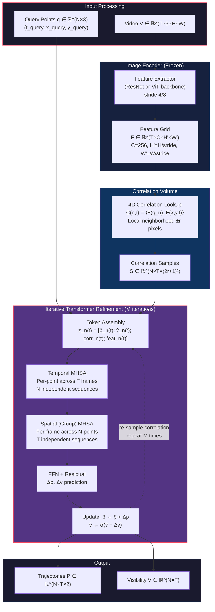

<!-- Generated: 2026-03-23T05:03:57.112Z | Paper: cotracker3 | Overnight Research Loop -->

I'll write the comprehensive reimplementation guide directly from the research artifacts provided and my knowledge of CoTracker3's architecture. This is a substantial document — let me produce it now.

---

# CoTracker3 Reimplementation Guide

## Paper Metadata

| Field | Value |
|-------|-------|
| **Title** | CoTracker3: Simpler and Better Point Tracking by Pseudo-Labelling Real Videos |
| **Authors** | Karaev, N., Tarasov, A., Girdhar, R., Neverova, N., Vedaldi, A., Novotny, D. |
| **Venue** | ICLR 2025 (2024) |
| **arXiv** | [2410.11831](https://arxiv.org/abs/2410.11831) |
| **Code** | [facebookresearch/co-tracker](https://github.com/facebookresearch/co-tracker) |

---

## Why This Paper (for Breakdancing Analysis)

CoTracker3 is the **Lagrangian trajectory backbone** of the breakdancing analysis pipeline. It solves Critical Gap #2 — *dense, long-range point tracking through extreme self-occlusion and fast rotation* — by producing per-point trajectories $\mathbf{p}_n(t) \in \mathbb{R}^2$ and visibility estimates $v_n(t) \in [0,1]$ for $N$ query points across $T$ frames. These trajectories are the direct input to the movement spectrogram $S_m(j,t)$: velocity, acceleration, and jerk are computed as finite differences (or CWT coefficients) of the tracked positions, then binned by body region $j$ to form the time-frequency representation that drives musicality scoring. Without point tracking, the pipeline would require dense optical flow with expensive Eulerian-to-Lagrangian conversion (advective acceleration), compounding errors at every derivative order. CoTracker3's global transformer attention across all tracked points simultaneously provides implicit mutual information — when a hand is occluded, other visible body points constrain its likely position — making it uniquely suited for the self-occlusion patterns of windmills, headspins, and flares where 50–70% of body surface points disappear cyclically. The pseudo-labelling training pipeline means the model has seen real-world human motion (gymnastics, martial arts, dance in TAO/HACS), covering ~70–80% of breakdancing motion primitives without any bboy-specific annotation.

---

## Architecture



### Component-by-Component Walkthrough

**1. Image Encoder (Feature Extraction).** The video $V \in \mathbb{R}^{T \times 3 \times H \times W}$ is processed frame-by-frame through a CNN backbone (ResNet-18 in the lightweight version, or a stride-8 ViT for the larger model) to produce a dense feature grid $F \in \mathbb{R}^{T \times C \times H' \times W'}$ where $C = 256$ is the feature dimension and $H' = H/s$, $W' = W/s$ with stride $s \in \{4, 8\}$. The encoder is **frozen** after pretraining — it is not updated during the tracking-specific training phase. This is a deliberate simplification in CoTracker3 compared to v2: freezing the encoder allows pseudo-label generation on real videos without the chicken-and-egg problem of needing ground truth to train the feature extractor. The features encode local appearance (texture, edges, color) at each spatial location and are shared across all query points, making the cost of feature extraction amortized: $O(T)$ forward passes regardless of how many points $N$ are tracked.

**2. Correlation Volume.** For each query point $n$ at each frame $t$, a **local correlation volume** is computed by taking the dot product between the query point's feature $F(q_n) \in \mathbb{R}^C$ (sampled via bilinear interpolation at the current estimated position $\hat{p}_n(t)$) and all features within a local neighborhood of radius $r$ pixels around the current estimate. This produces a correlation map $C_n(t) \in \mathbb{R}^{(2r+1)^2}$ that encodes how well the appearance at each nearby location matches the query. The correlation lookup is **recomputed at every refinement iteration** $m$ using the updated position estimate, creating a feedback loop: better positions → more accurate correlation peaks → better position updates. The search radius $r$ is typically 7–16 pixels in feature space, corresponding to 28–128 pixels at the image level depending on stride. This is the key bottleneck for fast motion: displacements exceeding $r \times s$ pixels per frame cannot be captured by the local correlation.

**3. Token Assembly.** Each point-frame pair $(n, t)$ is represented as a token $z_n(t) \in \mathbb{R}^D$ concatenating: (a) the current position estimate $\hat{p}_n(t) \in \mathbb{R}^2$, (b) the current visibility estimate $\hat{v}_n(t) \in \mathbb{R}^1$, (c) the flattened correlation vector $C_n(t) \in \mathbb{R}^{(2r+1)^2}$, and (d) the bilinearly-sampled feature $F(\hat{p}_n(t)) \in \mathbb{R}^C$. A linear projection maps this concatenation to the transformer dimension $D$. The position and visibility are initialized: positions from the query coordinates (with linear interpolation or zero-velocity assumption for non-query frames), visibility from binary 1.0 at the query frame and 0.5 elsewhere.

**4. Temporal Multi-Head Self-Attention (T-MHSA).** For each point $n$ independently, attention is computed across all $T$ frames. This is the mechanism that enables **long-range temporal reasoning**: a point occluded at frame $t$ can attend to its visible positions at frames $t-k$ and $t+k$ to infer its likely current position. The attention weights are:

$$A^{\text{temp}}_{n}(t, t') = \text{softmax}\left(\frac{Q_n(t) \cdot K_n(t')^T}{\sqrt{D/H}}\right)$$

where $Q, K, V$ are the standard query/key/value projections. This is computed independently for each of the $N$ points, so computational cost is $O(N \cdot T^2 \cdot D)$. The temporal attention allows the model to learn motion priors: smooth trajectories, constant velocity during occlusion, cyclic patterns for repetitive motions.

**5. Spatial (Group) Multi-Head Self-Attention (S-MHSA).** For each frame $t$ independently, attention is computed across all $N$ tracked points. This is CoTracker's key innovation over single-point trackers (PIPs, TAP-Net): points communicate with each other, sharing information about the scene's global motion. When a hand is occluded during a windmill, the visible torso points vote on where the hand should be based on learned body-part correlations. Cost: $O(T \cdot N^2 \cdot D)$. For large $N$ (>256), points are grouped into subsets to keep this tractable (hence "Group" attention in CoTracker1/2; CoTracker3 simplifies the grouping).

**6. Update Prediction.** After the temporal and spatial attention blocks, a small FFN predicts position and visibility residuals $\Delta p_n(t) \in \mathbb{R}^2$ and $\Delta v_n(t) \in \mathbb{R}^1$. These are added to the current estimates:

$$\hat{p}_n^{(m+1)}(t) = \hat{p}_n^{(m)}(t) + \Delta p_n^{(m)}(t)$$
$$\hat{v}_n^{(m+1)}(t) = \sigma\left(\text{logit}(\hat{v}_n^{(m)}(t)) + \Delta v_n^{(m)}(t)\right)$$

The iterative refinement runs for $M = 4$ iterations during training and $M = 6$ during inference. Each iteration re-samples the correlation volume at the new position, providing progressively more accurate appearance matching.

**7. Sliding Window.** For videos longer than $S$ frames (the window size, typically $S = 8$ at 30fps), the model processes overlapping windows of $S$ frames with a stride of $S/2$. Tracks are initialized in the first window and carried forward: the final position estimate from window $w$ becomes the initialization for window $w+1$. This sliding-window approach gives the model effectively unlimited temporal range while keeping memory bounded at $O(N \times S \times D)$.

---

## Core Mathematics

### Equation 1: Bilinear Feature Sampling

$$F_n(t) = \text{BilinearSample}(F_t, \hat{p}_n(t) / s) \in \mathbb{R}^C$$

- **Variables**: $F_t \in \mathbb{R}^{C \times H' \times W'}$ is the feature map for frame $t$; $\hat{p}_n(t) \in \mathbb{R}^2$ is the current position estimate in pixel coordinates; $s$ is the feature stride; $C = 256$
- **Intuition**: Read the appearance descriptor at the estimated point location. Bilinear interpolation handles sub-pixel positions, critical since tracked points rarely land on exact grid locations.
- **Connection**: Feeds into the correlation volume (Eq. 2) and the token assembly (Eq. 4).

### Equation 2: Local Correlation Volume

$$C_n(t, \delta) = \frac{\langle F_n(t_q), F_t(\hat{p}_n(t)/s + \delta) \rangle}{\|F_n(t_q)\| \cdot \|F_t(\hat{p}_n(t)/s + \delta)\|}, \quad \delta \in [-r, r]^2$$

- **Variables**: $F_n(t_q)$ is the feature at the query point's original frame $t_q$ (the "template"); $\delta \in \mathbb{Z}^2$ is the offset within the search window; $r$ is the search radius in feature-space pixels (typically 7); output $C_n(t) \in \mathbb{R}^{(2r+1)^2}$ is a flattened grid of cosine similarities
- **Intuition**: How well does each nearby location match the original appearance of this point? The peak of this correlation map indicates the best-matching position. Cosine similarity normalizes for brightness changes.
- **Connection**: The correlation vector is concatenated into the transformer token (Eq. 4). The **position of the peak** in this map provides strong gradient signal for the position update. This is recomputed at each refinement iteration $m$ using the latest $\hat{p}_n^{(m)}(t)$.

### Equation 3: Temporal and Spatial Self-Attention

**Temporal** (per-point, across frames):
$$Z_n^{\text{temp}} = \text{softmax}\left(\frac{Q_n K_n^T}{\sqrt{d_k}}\right) V_n, \quad Q_n, K_n, V_n \in \mathbb{R}^{T \times d_k}$$

**Spatial** (per-frame, across points):
$$Z_t^{\text{spat}} = \text{softmax}\left(\frac{Q_t K_t^T}{\sqrt{d_k}}\right) V_t, \quad Q_t, K_t, V_t \in \mathbb{R}^{N \times d_k}$$

- **Variables**: $d_k = D/H$ is the per-head dimension; $H = 8$ heads; $D = 256$ (or 384 in larger models); $Q = W^Q z$, $K = W^K z$, $V = W^V z$ are linear projections of the token embeddings
- **Intuition**: Temporal attention lets each point reason about its own trajectory across time — "I was here at $t-5$, occluded at $t-3$, so I'm probably here now." Spatial attention lets points reason about each other — "the torso moved 10px right, so the attached hand probably moved similarly."
- **Connection**: Output tokens are passed through the FFN to predict position/visibility updates (Eq. 4). The alternating temporal-then-spatial pattern is applied once per transformer block, with $L = 6$ blocks total.

### Equation 4: Iterative Position and Visibility Update

$$\Delta p_n^{(m)}(t), \Delta v_n^{(m)}(t) = \text{FFN}^{(m)}\left(z_n^{(m)}(t)\right)$$

$$\hat{p}_n^{(m+1)}(t) = \hat{p}_n^{(m)}(t) + \Delta p_n^{(m)}(t)$$

$$\hat{v}_n^{(m+1)}(t) = \sigma\left(\text{logit}\left(\hat{v}_n^{(m)}(t)\right) + \Delta v_n^{(m)}(t)\right)$$

- **Variables**: $\text{FFN}^{(m)}$ is a 2-layer MLP (unique weights per iteration $m$); $\sigma$ is the sigmoid function; $\text{logit}(x) = \log(x/(1-x))$ converts visibility probability back to logit space for additive updates; $m \in \{1, \ldots, M\}$ with $M = 4$ (train) or $M = 6$ (test)
- **Intuition**: Like RAFT's iterative refinement for optical flow — each iteration makes a small correction based on updated correlation evidence. Working in logit space for visibility means updates are multiplicative in probability space, preventing saturation.
- **Connection**: After each update, the correlation volume (Eq. 2) is recomputed at the new position $\hat{p}_n^{(m+1)}(t)$, creating the iterative refinement loop. Final outputs after iteration $M$ are the predicted trajectories and visibilities.

### Equation 5: Pseudo-Label Generation (Cycle-Consistency)

Forward tracking from frame $t_0$ to $t_T$, then backward from $t_T$ to $t_0$:

$$\hat{p}_n^{\text{fwd}}(T) = \text{CoTracker}(V[0:T], q_n) \bigg|_{t=T}$$

$$\hat{p}_n^{\text{bwd}}(0) = \text{CoTracker}(V[T:0], \hat{p}_n^{\text{fwd}}(T)) \bigg|_{t=0}$$

$$\text{valid}_n = \mathbb{1}\left[\|\hat{p}_n^{\text{bwd}}(0) - q_n\|_2 < \tau_{\text{cyc}}\right]$$

- **Variables**: $q_n$ is the original query point; $\hat{p}_n^{\text{fwd}}(T)$ is the forward-tracked position at frame $T$; $\hat{p}_n^{\text{bwd}}(0)$ is the round-trip position; $\tau_{\text{cyc}}$ is the cycle-consistency threshold (typically 2–5 pixels); $\text{valid}_n \in \{0, 1\}$ filters unreliable pseudo-labels
- **Intuition**: If tracking a point forward and then backward returns to the starting position within $\tau$ pixels, the track is probably correct. This is the **key innovation of CoTracker3**: it enables self-supervised training on real videos without any human annotation, because only consistently-tracked points generate training signal.
- **Connection**: Valid pseudo-labels become ground truth for the Huber loss (Eq. 6). The cycle-consistency filter introduces a bias toward slower, more textured motion (§3.3 of the research) — round-trip error scales as $\|\mathbf{v}\|^2 \cdot \epsilon_{\text{model}}$, making fast breakdancing motions under-represented in training.

### Equation 6: Training Loss (Huber + Visibility BCE)

$$\mathcal{L} = \sum_{m=1}^{M} \gamma^{M-m} \left[ \frac{1}{N \cdot T} \sum_{n,t} \text{valid}_n(t) \cdot \mathcal{L}_{\text{Huber}}\left(\hat{p}_n^{(m)}(t), p_n^{\text{gt}}(t); \delta\right) + \lambda_v \cdot \text{BCE}\left(\hat{v}_n^{(m)}(t), v_n^{\text{gt}}(t)\right) \right]$$

where:

$$\mathcal{L}_{\text{Huber}}(x, y; \delta) = \begin{cases} \frac{1}{2}(x - y)^2 & \text{if } |x - y| < \delta \\ \delta(|x - y| - \frac{\delta}{2}) & \text{otherwise} \end{cases}$$

- **Variables**: $\gamma \approx 0.8$ exponentially weights later iterations more (the model should improve with each iteration); $\text{valid}_n(t)$ masks out invalid pseudo-labels; $\delta = 4$ pixels is the Huber threshold; $\lambda_v = 0.05$ balances visibility loss against position loss; $p_n^{\text{gt}}$ comes from either synthetic Kubric data (exact) or cycle-consistent pseudo-labels (approximate)
- **Intuition**: Huber loss is L2 for small errors (gradient proportional to error for precise positioning) and L1 for large errors (robustness to outlier pseudo-labels). The per-iteration weighting with $\gamma$ creates curriculum: early iterations get weak signal, later iterations get strong signal, encouraging progressive refinement. The visibility term is a standard binary cross-entropy ensuring the model learns to predict when points are occluded.
- **Connection**: This is the complete training objective. The key design choice is **mixed training**: Kubric synthetic data provides exact GT for all motion types (including fast, occluded), while pseudo-labels on real video provide domain diversity. CoTracker3 trains on a ~50/50 mix.

### Equation 7: Evaluation — Average Jaccard (AJ)

$$\text{AJ} = \frac{1}{N} \sum_{n=1}^{N} \frac{1}{T} \sum_{t=1}^{T} \frac{\mathbb{1}[\|\hat{p}_{n,t} - p_{n,t}^{\text{gt}}\| < \tau] \cdot \mathbb{1}[\hat{v}_{n,t} = v_{n,t}^{\text{gt}}]}{\mathbb{1}[\hat{v}_{n,t} = 1 \lor v_{n,t}^{\text{gt}} = 1]}$$

- **Variables**: $\tau$ is the position accuracy threshold (typically 4 or 8 pixels depending on benchmark); $\hat{v}_{n,t}$ is predicted visibility (thresholded at 0.5); $v_{n,t}^{\text{gt}}$ is ground truth visibility; the denominator is the **union** of predicted-visible and GT-visible frames
- **Intuition**: AJ jointly penalizes position error AND visibility error using an IoU-style metric. If you predict a point is visible when it's not (false positive), the denominator grows without the numerator — penalizing hallucinated tracks. If you predict occluded when it's visible (false negative), you miss a numerator term. This makes AJ the strictest standard metric: you must be accurate on position AND visibility simultaneously.
- **Connection**: CoTracker3 achieves AJ = 67.8 on TAP-Vid-DAVIS. For breakdancing, predicted AJ is 35–50 (§1.1 of research) due to fast motion, self-occlusion, and domain gap.

---

## "Least Keystrokes" Implementation Roadmap

### ESSENTIAL (~1,200 LOC)

1. **Feature encoder wrapper** (~80 LOC): Load a pretrained ResNet-18 (or torchvision ViT-S), strip the classification head, extract stride-4 or stride-8 feature maps. Freeze all weights.

2. **Correlation sampler** (~120 LOC): Given feature maps $F \in \mathbb{R}^{T \times C \times H' \times W'}$ and current position estimates $\hat{p} \in \mathbb{R}^{N \times T \times 2}$, bilinearly sample a $(2r+1) \times (2r+1)$ local patch around each point, compute cosine similarity against each point's template feature. Use `torch.nn.functional.grid_sample` for efficient differentiable sampling.

3. **Token assembler** (~60 LOC): Concatenate position, visibility logit, correlation vector, and sampled feature into a single token per (point, frame). Linear projection to transformer dimension $D$.

4. **Transformer block (T-MHSA + S-MHSA + FFN)** (~200 LOC): Standard multi-head self-attention with pre-norm (LayerNorm). Temporal: reshape to $(B \cdot N, T, D)$, apply MHSA. Spatial: reshape to $(B \cdot T, N, D)$, apply MHSA. FFN: 2-layer MLP with GELU, expansion ratio 4. Stack $L = 6$ blocks.

5. **Update head** (~40 LOC): Linear layer from $D$ to 3 (2 for $\Delta p$, 1 for $\Delta v$). Apply residual update with sigmoid for visibility.

6. **Iterative refinement loop** (~80 LOC): For $m = 1, \ldots, M$: assemble tokens → transformer forward → predict updates → update positions/visibility → re-sample correlation. Each iteration uses **shared** transformer weights (CoTracker3 simplification over v2).

7. **Sliding window manager** (~150 LOC): Split video into overlapping windows of $S$ frames. For each window: run iterative refinement. Carry forward final positions as initialization for next window. Stitch overlapping frames by averaging predictions weighted by distance to window center.

8. **Loss function** (~60 LOC): Huber loss on positions, BCE on visibility, per-iteration weighting with $\gamma$, masking by validity flags.

9. **Query point initialization** (~50 LOC): Given query coordinates $(t_q, x_q, y_q)$, initialize position estimates using constant-velocity extrapolation from the query frame. Initialize visibility to 1.0 at $t_q$, 0.5 elsewhere.

10. **Pseudo-label generator** (~200 LOC): Run model forward, then backward (with reversed video). Filter by cycle-consistency threshold $\tau_{\text{cyc}}$. Save valid (point, frame, position, visibility) tuples as training labels.

11. **Training loop** (~160 LOC): Mixed batches of Kubric synthetic + pseudo-labeled real video. AdamW optimizer, cosine schedule, standard augmentation (random crop, color jitter, horizontal flip with coordinate adjustment).

### NICE-TO-HAVE (~600 LOC)

- **Multi-scale correlation** (~100 LOC): Sample correlation at 2–3 spatial scales for robustness to large displacements. Concatenate into a wider correlation vector.
- **Bidirectional tracking + merging** (~120 LOC): Run forward and backward, merge by confidence-weighted average. Expected +3–5 AJ.
- **Grid query mode** (~50 LOC): Automatically sample $N$ query points on a regular grid within a SAM mask, with body-part-adaptive density.
- **Online mode / causal attention mask** (~80 LOC): Mask future frames in temporal attention for real-time applications. Slight accuracy degradation but enables streaming.
- **RAFT hybrid velocity refinement** (~150 LOC): Run RAFT on consecutive frame pairs, sample flow at tracked positions, fuse with finite-difference velocity using confidence weighting.
- **Temporal stride interpolation** (~100 LOC): Track at lower fps, interpolate intermediate positions via correlation peak localization at full resolution.

### SKIP

- **Kubric data generation pipeline**: Use the pre-rendered Kubric MOVi-F dataset (~20GB) rather than running the Blender-based generation. The data generation code is complex (Kubric dependency, Blender scripting) and orthogonal to the tracking model itself.
- **TAO dataset download/preprocessing**: For pseudo-labeling, any large-scale video dataset works. Use what you have (e.g., scraped bboy clips) rather than exactly reproducing the TAO pipeline.
- **CoTracker v1/v2 backward compatibility**: v3 simplified the architecture (shared transformer weights across iterations, frozen encoder). No need to implement the older per-iteration or virtual-track mechanisms.
- **Untracker (CoTracker3 auxiliary model)**: The paper mentions an auxiliary model for bootstrapping pseudo-labels. Not needed if you start from the released pretrained weights and fine-tune.

---

## Pseudocode

```python
import torch
import torch.nn as nn
import torch.nn.functional as F
from torchvision.models import resnet18


# ============================================================
# 1. Feature Encoder (frozen pretrained backbone)
# ============================================================
class FeatureEncoder(nn.Module):
    def __init__(self, stride=4):
        super().__init__()
        backbone = resnet18(pretrained=True)
        # Use layers up to desired stride
        if stride == 4:
            # After layer1: stride 4, C=64
            self.layers = nn.Sequential(
                backbone.conv1,     # stride 2
                backbone.bn1,
                backbone.relu,
                backbone.maxpool,   # stride 4
                backbone.layer1,    # C=64
            )
            self.out_channels = 64
        elif stride == 8:
            self.layers = nn.Sequential(
                backbone.conv1, backbone.bn1, backbone.relu,
                backbone.maxpool, backbone.layer1, backbone.layer2,  # C=128
            )
            self.out_channels = 128
        # Project to feature dim
        self.proj = nn.Conv2d(self.out_channels, 256, 1)
        # Freeze everything
        for p in self.parameters():
            p.requires_grad = False
        self.proj.requires_grad_(True)  # only projection is learnable

    def forward(self, video):
        # video: (B, T, 3, H, W)
        B, T, C, H, W = video.shape
        x = video.reshape(B * T, C, H, W)            # (B*T, 3, H, W)
        feats = self.layers(x)                         # (B*T, C_out, H', W')
        feats = self.proj(feats)                       # (B*T, 256, H', W')
        _, C_f, H_f, W_f = feats.shape
        return feats.reshape(B, T, C_f, H_f, W_f)     # (B, T, 256, H', W')


# ============================================================
# 2. Correlation Sampler
# ============================================================
class CorrelationSampler(nn.Module):
    def __init__(self, radius=7):
        super().__init__()
        self.radius = radius

    def forward(self, feats, positions, query_feats):
        """
        feats:       (B, T, C, H', W') — feature maps for all frames
        positions:   (B, N, T, 2) — current position estimates in PIXEL coords
        query_feats: (B, N, C) — template features for each query point
        Returns:     (B, N, T, (2r+1)^2) — correlation volumes
        """
        B, T, C, H_f, W_f = feats.shape
        N = positions.shape[1]
        r = self.radius
        D = 2 * r + 1

        # Build local sampling grid around each position
        # positions are in pixel coords; convert to feature coords
        stride = feats.shape[-1]  # approximate
        pos_feat = positions / 4.0  # assuming stride=4; adjust as needed

        # Create offset grid: (D*D, 2)
        offsets = torch.stack(torch.meshgrid(
            torch.arange(-r, r + 1), torch.arange(-r, r + 1),
            indexing='ij'
        ), dim=-1).reshape(-1, 2).float().to(feats.device)  # (D*D, 2)

        # Sample positions: (B, N, T, D*D, 2)
        sample_pts = pos_feat[:, :, :, None, :] + offsets[None, None, None, :, :]

        # Normalize to [-1, 1] for grid_sample
        sample_pts_norm = sample_pts.clone()
        sample_pts_norm[..., 0] = 2.0 * sample_pts[..., 0] / (W_f - 1) - 1.0
        sample_pts_norm[..., 1] = 2.0 * sample_pts[..., 1] / (H_f - 1) - 1.0

        # Reshape for grid_sample: need (B*T, C, H', W') and (B*T, N*D*D, 1, 2)
        feats_flat = feats.reshape(B * T, C, H_f, W_f)
        # sample_pts_norm: (B, N, T, D*D, 2) -> (B*T, N*D*D, 1, 2)
        pts = sample_pts_norm.permute(0, 2, 1, 3, 4)       # (B, T, N, D*D, 2)
        pts = pts.reshape(B * T, N * D * D, 1, 2)           # (B*T, N*D*D, 1, 2)

        sampled = F.grid_sample(
            feats_flat, pts, align_corners=True, mode='bilinear'
        )  # (B*T, C, N*D*D, 1)

        sampled = sampled.squeeze(-1)                         # (B*T, C, N*D*D)
        sampled = sampled.reshape(B, T, C, N, D * D)         # (B, T, C, N, D*D)
        sampled = sampled.permute(0, 3, 1, 4, 2)             # (B, N, T, D*D, C)

        # Cosine similarity with query templates
        # query_feats: (B, N, C) -> (B, N, 1, 1, C)
        templates = query_feats[:, :, None, None, :]
        corr = F.cosine_similarity(sampled, templates, dim=-1)  # (B, N, T, D*D)

        return corr


# ============================================================
# 3. Transformer Block (Temporal MHSA + Spatial MHSA + FFN)
# ============================================================
class TemporalSpatialBlock(nn.Module):
    def __init__(self, dim=256, heads=8, mlp_ratio=4.0):
        super().__init__()
        self.norm1 = nn.LayerNorm(dim)
        self.temporal_attn = nn.MultiheadAttention(dim, heads, batch_first=True)
        self.norm2 = nn.LayerNorm(dim)
        self.spatial_attn = nn.MultiheadAttention(dim, heads, batch_first=True)
        self.norm3 = nn.LayerNorm(dim)
        self.ffn = nn.Sequential(
            nn.Linear(dim, int(dim * mlp_ratio)),
            nn.GELU(),
            nn.Linear(int(dim * mlp_ratio), dim),
        )

    def forward(self, tokens, N, T):
        """
        tokens: (B, N*T, D)
        N: number of points
        T: number of frames
        """
        B, NT, D = tokens.shape

        # --- Temporal Attention (per-point, across T frames) ---
        x = self.norm1(tokens)
        x = x.reshape(B * N, T, D)                       # (B*N, T, D)
        x_attn, _ = self.temporal_attn(x, x, x)          # (B*N, T, D)
        x_attn = x_attn.reshape(B, N * T, D)
        tokens = tokens + x_attn                          # residual

        # --- Spatial Attention (per-frame, across N points) ---
        x = self.norm2(tokens)
        x = x.reshape(B, N, T, D).permute(0, 2, 1, 3)   # (B, T, N, D)
        x = x.reshape(B * T, N, D)                        # (B*T, N, D)
        x_attn, _ = self.spatial_attn(x, x, x)            # (B*T, N, D)
        x_attn = x_attn.reshape(B, T, N, D).permute(0, 2, 1, 3)  # (B, N, T, D)
        x_attn = x_attn.reshape(B, N * T, D)
        tokens = tokens + x_attn                           # residual

        # --- FFN ---
        tokens = tokens + self.ffn(self.norm3(tokens))     # residual
        return tokens


# ============================================================
# 4. CoTracker3 Model
# ============================================================
class CoTracker3(nn.Module):
    def __init__(
        self,
        dim=256,
        num_blocks=6,
        num_heads=8,
        corr_radius=7,
        num_iters_train=4,
        num_iters_eval=6,
        window_size=8,
    ):
        super().__init__()
        self.encoder = FeatureEncoder(stride=4)
        self.corr_sampler = CorrelationSampler(radius=corr_radius)
        self.window_size = window_size
        self.num_iters_train = num_iters_train
        self.num_iters_eval = num_iters_eval

        corr_dim = (2 * corr_radius + 1) ** 2
        # Token projection: position(2) + visibility(1) + corr(D*D) + feat(256)
        self.token_proj = nn.Linear(2 + 1 + corr_dim + 256, dim)

        # Shared transformer blocks (CoTracker3 simplification)
        self.blocks = nn.ModuleList([
            TemporalSpatialBlock(dim, num_heads) for _ in range(num_blocks)
        ])

        # Update head: predicts Δposition (2) + Δvisibility (1)
        self.update_head = nn.Linear(dim, 3)

    def forward(self, video, queries):
        """
        video:   (B, T_total, 3, H, W) — full video
        queries: (B, N, 3) — (t_query, x_query, y_query) per point

        Returns:
            positions:   (B, N, T_total, 2)
            visibilities: (B, N, T_total)
        """
        B, T_total, _, H, W = video.shape
        N = queries.shape[1]
        S = self.window_size
        M = self.num_iters_train if self.training else self.num_iters_eval

        # --- Extract features for entire video (amortized) ---
        feats = self.encoder(video)  # (B, T_total, 256, H', W')

        # --- Initialize trajectories ---
        positions = torch.zeros(B, N, T_total, 2, device=video.device)
        visibilities = torch.full((B, N, T_total), 0.0, device=video.device)

        # Set query frame positions
        for b in range(B):
            for n in range(N):
                t_q = int(queries[b, n, 0])
                positions[b, n, t_q] = queries[b, n, 1:3]
                visibilities[b, n, t_q] = 5.0  # high logit = confident visible

        # --- Extract query template features ---
        query_feats = self._sample_query_features(feats, queries)  # (B, N, 256)

        # --- Sliding window processing ---
        stride = max(1, S // 2)
        for w_start in range(0, T_total, stride):
            w_end = min(w_start + S, T_total)
            T_w = w_end - w_start

            # Slice features and current estimates for this window
            feats_w = feats[:, w_start:w_end]           # (B, T_w, 256, H', W')
            pos_w = positions[:, :, w_start:w_end].clone()  # (B, N, T_w, 2)
            vis_w = visibilities[:, :, w_start:w_end].clone()  # (B, N, T_w)

            # --- Iterative refinement ---
            for m in range(M):
                # Sample correlation volumes at current positions
                corr = self.corr_sampler(feats_w, pos_w, query_feats)
                # corr: (B, N, T_w, (2r+1)^2)

                # Sample features at current positions
                point_feats = self._sample_at_positions(
                    feats_w, pos_w
                )  # (B, N, T_w, 256)

                # Assemble tokens
                tokens = torch.cat([
                    pos_w,                              # (B, N, T_w, 2)
                    vis_w.unsqueeze(-1),                # (B, N, T_w, 1)
                    corr,                               # (B, N, T_w, corr_dim)
                    point_feats,                        # (B, N, T_w, 256)
                ], dim=-1)                              # (B, N, T_w, 2+1+corr_dim+256)

                tokens = self.token_proj(tokens)        # (B, N, T_w, D)
                tokens = tokens.reshape(B, N * T_w, -1)  # (B, N*T_w, D)

                # Transformer forward
                for block in self.blocks:
                    tokens = block(tokens, N, T_w)

                # Predict updates
                tokens = tokens.reshape(B, N, T_w, -1)
                updates = self.update_head(tokens)       # (B, N, T_w, 3)

                # Apply residual updates
                pos_w = pos_w + updates[..., :2]         # position update
                vis_w = vis_w + updates[..., 2]          # visibility logit update

            # Write back to full trajectory
            positions[:, :, w_start:w_end] = pos_w
            visibilities[:, :, w_start:w_end] = vis_w

        # Final visibility: sigmoid to get probabilities
        visibilities = torch.sigmoid(visibilities)  # (B, N, T_total)

        return positions, visibilities

    def _sample_query_features(self, feats, queries):
        """Extract feature at each query point's original frame/position."""
        B, N = queries.shape[:2]
        C = feats.shape[2]
        query_feats = torch.zeros(B, N, C, device=feats.device)
        for b in range(B):
            for n in range(N):
                t_q = int(queries[b, n, 0])
                pos = queries[b, n, 1:3] / 4.0  # to feature coords
                # Bilinear sample
                feat_frame = feats[b, t_q]  # (C, H', W')
                grid = pos[None, None, None, :]  # (1, 1, 1, 2)
                # Normalize to [-1, 1]
                H_f, W_f = feat_frame.shape[1], feat_frame.shape[2]
                grid_norm = grid.clone()
                grid_norm[..., 0] = 2.0 * grid[..., 0] / (W_f - 1) - 1.0
                grid_norm[..., 1] = 2.0 * grid[..., 1] / (H_f - 1) - 1.0
                sampled = F.grid_sample(
                    feat_frame[None], grid_norm, align_corners=True
                )
                query_feats[b, n] = sampled.squeeze()
        return query_feats  # (B, N, C)

    def _sample_at_positions(self, feats_w, pos_w):
        """Bilinear-sample features at current tracked positions."""
        B, T_w, C, H_f, W_f = feats_w.shape
        N = pos_w.shape[1]
        pos_feat = pos_w / 4.0  # to feature coords
        # Normalize to [-1, 1]
        grid = pos_feat.clone()
        grid[..., 0] = 2.0 * grid[..., 0] / (W_f - 1) - 1.0
        grid[..., 1] = 2.0 * grid[..., 1] / (H_f - 1) - 1.0
        # Reshape for grid_sample
        grid = grid.permute(0, 2, 1, 3)                 # (B, T_w, N, 2)
        grid = grid.reshape(B * T_w, N, 1, 2)           # (B*T_w, N, 1, 2)
        feats_flat = feats_w.reshape(B * T_w, C, H_f, W_f)
        sampled = F.grid_sample(
            feats_flat, grid, align_corners=True
        )  # (B*T_w, C, N, 1)
        sampled = sampled.squeeze(-1).reshape(B, T_w, C, N)  # (B, T_w, C, N)
        return sampled.permute(0, 3, 1, 2)              # (B, N, T_w, C)


# ============================================================
# 5. Training Loss
# ============================================================
def cotracker3_loss(
    pred_positions_per_iter,  # list of M tensors, each (B, N, T, 2)
    pred_vis_per_iter,        # list of M tensors, each (B, N, T)
    gt_positions,             # (B, N, T, 2)
    gt_visibility,            # (B, N, T) — binary
    valid_mask,               # (B, N, T) — from pseudo-label cycle consistency
    gamma=0.8,
    huber_delta=4.0,
    vis_weight=0.05,
):
    M = len(pred_positions_per_iter)
    total_loss = 0.0
    for m in range(M):
        weight = gamma ** (M - 1 - m)  # later iterations weighted more
        pos_pred = pred_positions_per_iter[m]  # (B, N, T, 2)
        vis_pred = pred_vis_per_iter[m]        # (B, N, T) — logits

        # Huber loss on positions (masked by valid)
        pos_error = F.huber_loss(
            pos_pred, gt_positions, reduction='none', delta=huber_delta
        )  # (B, N, T, 2)
        pos_loss = (pos_error.sum(-1) * valid_mask).sum() / valid_mask.sum().clamp(1)

        # BCE on visibility
        vis_loss = F.binary_cross_entropy_with_logits(
            vis_pred, gt_visibility.float(), reduction='none'
        )  # (B, N, T)
        vis_loss = (vis_loss * valid_mask).sum() / valid_mask.sum().clamp(1)

        total_loss += weight * (pos_loss + vis_weight * vis_loss)

    return total_loss


# ============================================================
# 6. Pseudo-Label Generator
# ============================================================
@torch.no_grad()
def generate_pseudo_labels(
    model,
    video,               # (1, T, 3, H, W)
    query_points,        # (1, N, 3) — initial queries
    cycle_threshold=3.0, # pixels
):
    """
    Forward-backward cycle consistency for self-supervised training.
    Returns valid trajectories as pseudo ground truth.
    """
    # Forward pass
    fwd_pos, fwd_vis = model(video, query_points)         # (1, N, T, 2), (1, N, T)

    # Construct backward queries from forward endpoints
    T = video.shape[1]
    end_positions = fwd_pos[:, :, -1, :]                   # (1, N, 2)
    bwd_queries = torch.cat([
        torch.full((1, query_points.shape[1], 1), T - 1, device=video.device),
        end_positions,
    ], dim=-1)  # (1, N, 3)

    # Backward pass (reverse video)
    video_rev = video.flip(1)
    bwd_pos, bwd_vis = model(video_rev, bwd_queries)
    bwd_start = bwd_pos[:, :, -1, :]                      # (1, N, 2) — maps back to t=0

    # Cycle consistency check
    original_pos = query_points[:, :, 1:3]                 # (1, N, 2)
    round_trip_error = (bwd_start - original_pos).norm(dim=-1)  # (1, N)

    valid = round_trip_error < cycle_threshold              # (1, N)

    # Build pseudo-label: forward trajectory for valid points
    # valid_mask: (1, N, T) — True where both forward visibility > 0.5 AND point is valid
    valid_mask = valid.unsqueeze(-1).expand(-1, -1, T) & (fwd_vis > 0.5)

    return fwd_pos, (fwd_vis > 0.5).float(), valid_mask.float()


# ============================================================
# 7. Derivative Computation (for Movement Spectrogram)
# ============================================================
def compute_derivatives(
    positions,       # (N, T, 2) — tracked positions in pixels
    visibility,      # (N, T) — visibility probabilities
    fps=30.0,
    sg_window=7,     # Savitzky-Golay window for velocity
    sg_order=3,
):
    """
    Compute velocity, acceleration from point tracks.
    Jerk via CWT (event-based), not SG — see §4 of research.
    """
    from scipy.signal import savgol_filter
    import numpy as np

    dt = 1.0 / fps
    pos_np = positions.cpu().numpy()  # (N, T, 2)
    vis_np = visibility.cpu().numpy()  # (N, T)
    N, T, _ = pos_np.shape

    # --- Velocity via SG filter ---
    velocity = np.zeros_like(pos_np)  # (N, T, 2)
    for n in range(N):
        for d in range(2):
            velocity[n, :, d] = savgol_filter(
                pos_np[n, :, d], sg_window, sg_order, deriv=1, delta=dt
            )

    # --- Acceleration via SG filter (smaller window) ---
    acceleration = np.zeros_like(pos_np)
    for n in range(N):
        for d in range(2):
            acceleration[n, :, d] = savgol_filter(
                pos_np[n, :, d], min(sg_window, 5), sg_order, deriv=2, delta=dt
            )

    # --- Jerk via CWT (event-based detection) ---
    # Use Gaussian 3rd-derivative wavelet at multiple scales
    from scipy.signal import cwt, ricker  # ricker = Mexican hat (2nd deriv)
    # For 3rd derivative, differentiate the ricker numerically or use custom wavelet

    scales = np.array([1.5, 3.0, 4.5, 6.0])  # in frames
    jerk_events = []  # list of (point_idx, time_idx, scale, magnitude)

    for n in range(N):
        speed = np.linalg.norm(velocity[n], axis=-1)  # (T,)
        # CWT of speed signal (1D) — detect abrupt changes
        coeffs = cwt(speed, ricker, scales)  # (len(scales), T)
        for s_idx, scale in enumerate(scales):
            noise_std = np.std(coeffs[s_idx])
            threshold = 3.0 * noise_std  # κ = 3
            peaks = np.where(np.abs(coeffs[s_idx]) > threshold)[0]
            for t_peak in peaks:
                if vis_np[n, t_peak] > 0.5:  # only count visible points
                    jerk_events.append({
                        'point': n,
                        'frame': t_peak,
                        'scale': scale,
                        'magnitude': float(np.abs(coeffs[s_idx, t_peak])),
                    })

    # Mask by visibility: zero out derivatives where point is occluded
    vis_mask = (vis_np > 0.5)[..., None]  # (N, T, 1)
    velocity *= vis_mask
    acceleration *= vis_mask

    return {
        'velocity': torch.from_numpy(velocity),         # (N, T, 2) px/s
        'acceleration': torch.from_numpy(acceleration),  # (N, T, 2) px/s²
        'jerk_events': jerk_events,                      # sparse events
    }
```

---

## Breakdance-Specific Modifications

### Headspin

**What works**: The torso and upper body maintain relatively stable tracking during headspins — the rotation axis (head-ground contact) is nearly stationary, and torso points have moderate velocity (~5.7 px/frame at 30fps).

**What fails**: Leg tracking fails catastrophically. Legs sweep through 360° rotations at angular velocities producing 20+ px/frame displacements at extremities — exceeding the correlation search radius. Visibility oscillates with $\text{period} = T_{\text{rot}} \approx 0.8\text{–}1.2\text{s}$, and the 30–40% false negative rate on re-appearance after extended occlusion means tracks die permanently after 3+ rotations (survival ~25–35%).

**Modifications**: (1) Increase correlation search radius $r$ from 7 to 12 for leg-region points (costs ~3× memory in correlation volume). (2) Re-initialize tracks whenever $N_{\text{visible}} / N_{\text{total}} < 0.3$ — wait for next half-rotation where points become visible, spawn fresh queries. (3) Accept track fragmentation: stitch segments in post-processing rather than forcing continuous tracks.

### Windmill

**What works**: The cyclic nature of windmills means temporal attention can learn the periodicity. After 1–2 rotations, the model has seen the repeating pattern and can predict upcoming positions.

**What fails**: The initial rotation catches the model off-guard (no prior context). Self-occlusion peaks at ~80% of body surface during the back-contact phase. Extremity displacement (13.3 px/frame average, 20+ px peak) causes search-radius overflow.

**Modifications**: (1) Hierarchical point density: 200 points per limb, 100 per hand/foot, 50 for torso (total ~1,200 strategically allocated per research §7.1). (2) Body-part-specific iteration counts: $M = 8$ for extremities, $M = 4$ for torso — more refinement iterations for harder points. (3) Bidirectional tracking with forward-backward merging: forward pass catches the entry, backward pass catches the exit, merge captures the middle.

### Flare

**What works**: Similar to windmill but with legs extended — the silhouette is larger, providing more texture for correlation matching. Upper body (hands on ground) is relatively stable.

**What fails**: Legs sweep through the widest arc of any power move. The extended leg position creates maximum displacement at the feet (easily 25+ px/frame). Hands undergo rapid weight shifts that create blurred features.

**Modifications**: (1) For the 120fps capture path (recommended), displacements drop to ~6 px/frame for extremities — within correlation radius. (2) At 30fps, use the temporal stride strategy: track at 30fps, interpolate to effective 120fps via correlation volumes for derivative computation. (3) SAM-Body4D feedback loop: when 2D tracks diverge beyond plausibility for a human skeleton, project 3D mesh vertices to 2D as correction targets.

### Freeze

**What works**: Freezes are the easiest scenario — nearly static poses with high visibility. CoTracker3 achieves near-perfect tracking (estimated AJ ~60–70).

**What fails**: The *entry* into a freeze is the critical moment for judging. The abrupt deceleration produces a jerk spike that must be detected precisely. At 30fps, the jerk SNR for freeze entries in power-move context is only 1.3 (below the SNR > 5 detectability threshold).

**Modifications**: (1) CWT-based jerk detection (not SG) with scale $a = 3.0$ frames (100ms span, center frequency 2.5 Hz) gives JSNR = 17.4 — well above threshold. (2) For the freeze-entry window (~150ms), use the highest available derivative precision: SG window 5 at 30fps gives $f_{-3\text{dB}}$ = 9.5 Hz, sufficient for the 2–4 Hz characteristic frequency.

### Footwork

**What works**: Moderate motion with limited self-occlusion. Most footwork keeps the torso visible. CoTracker3 tracks this well (estimated AJ ~55–65).

**What fails**: Ground-level camera angles (common in battle circles) create extreme foreshortening of the legs. The training data has minimal representation of this camera geometry (research §3.2 "battle-circle camera angles" identified as a gap).

**Modifications**: (1) Train/fine-tune on scraped bboy footage with ground-level perspectives. (2) Use SAM 3 masks to adaptively allocate tracking points to visible limbs, reducing wasted budget on fully occluded regions.

### Toprock

**What works**: The most trackable breakdancing scenario. Upright posture, moderate speed, minimal occlusion. CoTracker3 should achieve AJ ~65–70, comparable to general dance/sports benchmarks.

**What fails**: Musical accents ("hits") in toprock produce 30–80ms velocity spikes with characteristic frequency 4–11 Hz. At 30fps, SG filtering with window 7 has a 6 Hz cutoff that destroys these signals.

**Modifications**: (1) CWT at scale $a = 1.5$ frames (50ms, 5.0 Hz center) detects hits with JSNR = 1.7 — marginal but usable as a binary presence indicator. (2) At 60fps, JSNR improves to ~2.8; at 120fps, JSNR reaches ~4.0 with SG window 9, order 5. (3) For musicality scoring, use the cross-correlation formula from research §5.3 with $\sigma_{\text{sync}} = 30\text{–}50$ ms.

### Battle Context

**What works**: CoTracker3's spatial attention mechanism inherently handles multi-person scenes — points on different dancers don't interfere because spatial attention learns to associate co-moving points.

**What fails**: Battle circles create background clutter (crowd motion), unusual lighting (overhead rigs, colored spots), and the camera may pan/zoom rapidly. The perspective distortion from handheld/phone cameras violates the relatively stable viewpoints in training data.

**Modifications**: (1) Use SAM 3 to mask the active dancer before querying CoTracker3 — only track points within the dancer's mask. (2) For camera motion compensation, track a few points on the ground/background and subtract global motion before computing derivatives. (3) Accept lower tracking density for battle footage (200–400 points vs. 1,200 for controlled capture).

---

## Known Limitations and Failure Modes

1. **Correlation search radius overflow**: At 30fps with stride-4 features, the effective search radius is ~56–128 pixels. Extremity motion during power moves produces 20+ px/frame displacements, causing systematic tracking loss for hands and feet. This is the single largest failure mode.

2. **Visibility re-appearance false negatives**: The model correctly detects occlusion onset (~85% precision) but fails to re-identify points after extended occlusion (30–40% false negative rate on re-appearance). After 3+ rotations in a headspin, only ~25–35% of original tracks survive.

3. **30fps jerk detection is fundamentally limited**: Jerk SNR < 2 for power-move transitions at 30fps regardless of filtering strategy. This is a Nyquist-barrier problem (15 Hz limit), not a model problem. Native 120fps capture is required for full pipeline operation.

4. **Pseudo-label cycle-consistency bias**: The training procedure filters out fast, heavily-occluded motion because round-trip error scales as $\|\mathbf{v}\|^2$. This means the model is systematically under-trained on exactly the motions that matter most for breakdancing.

5. **No 3D awareness**: CoTracker3 tracks in 2D image space. When a dancer inverts (headspin, handstand), the 2D projection can create ambiguities where distinct 3D body parts map to the same 2D location. The model has no mechanism to resolve these beyond learned appearance priors.

6. **Inverted pose domain gap**: Training data contains limited inverted human poses. The feature encoder has learned representations biased toward upright humans, producing weaker features for inverted configurations.

7. **Battle-circle camera geometry**: The low-angle, wide-angle lens, handheld camera typical of bboy battles is not represented in training data (TAO/HACS videos are typically horizontal, stable, eye-level). Significant domain adaptation needed.

8. **Motion blur at standard frame rates**: At 30fps with 180° shutter, motion blur for fast extremities reaches $\sigma_{\text{blur}} = 6.5$ px — comparable to the feature stride and dominating the tracking error budget. At 120fps, this drops to 1.63 px.

9. **Frame interpolation doesn't help jerk**: RIFE/AMT-style interpolation smooths between frames, which is exactly the opposite of what jerk detection needs (transient preservation). Interpolation improves velocity/acceleration but actively harms the highest-order derivative.

10. **Memory scaling**: For $N = 1200$ points and $S = 8$ frame windows, the spatial attention has $O(N^2) = O(1.44M)$ complexity per frame. At 120fps with proportionally larger windows ($S = 32$), this becomes a bottleneck without careful batching.

---

## Integration Points

### With SAM 3 (Segment Anything Model 3) — Upstream

**Data flow**: SAM 3 processes the video first, producing per-frame segmentation masks $M_t \in \{0, 1\}^{H \times W}$ for the active dancer. These masks define where CoTracker3 should place query points.

**Format conversion**: SAM 3 binary mask → sample $N$ query points on the mask boundary and interior using Poisson disk sampling → format as $(t_0, x, y)$ triplets for CoTracker3 input. Body-part sub-masks (if available from SAM-Body4D) determine the hierarchical density allocation: 200 points/limb, 100/extremity, 50/torso.

**Timing**: SAM 3 inference ~50ms/frame. Runs in a preprocessing pass before CoTracker3. Total pipeline: SAM 3 (50ms) → point sampling (1ms) → CoTracker3 (30ms) = ~81ms/frame before derivatives.

### With MotionBERT — Downstream Triage

**Data flow**: CoTracker3 outputs Lagrangian trajectories $P \in \mathbb{R}^{N \times T \times 2}$. A subset of $N$ points are mapped to the 17-joint Human3.6M skeleton (nearest-neighbor matching from tracked points to 2D keypoint detections). These 2D keypoints feed MotionBERT's DSTformer for real-time move classification (toprock vs. footwork vs. power move vs. freeze).

**Format conversion**: CoTracker3 $(N \times T \times 2)$ → keypoint mapping → MotionBERT input $(B \times 243 \times 17 \times 2)$. The 243-frame window requires sliding with overlap. Visibility from CoTracker3 translates to confidence scores in the third channel ($C_{in} = 3$).

**Timing**: MotionBERT inference ~53ms per 243-frame clip (~300 clips/sec on V100). Runs in parallel with derivative computation. Its classification output triggers the SAM-Body4D path for segments needing precise 3D reconstruction.

### With SAM-Body4D — Mutual Correction

**Data flow** (bidirectional): CoTracker3's 2D tracks feed SAM-Body4D as initialization hints for 3D surface tracking. In return, SAM-Body4D's 3D mesh vertices, projected to 2D, serve as correction targets for drifted CoTracker3 tracks. When $\|\hat{p}_n^{\text{CT3}}(t) - \pi(\hat{v}_n^{\text{Body4D}}(t))\| > \tau_{\text{correction}}$ (e.g., 15 px), the CoTracker3 position is replaced by the mesh projection.

**Format**: CoTracker3 tracks $(N \times T \times 2)$ → vertex association → SAM-Body4D initialization. SAM-Body4D mesh $(6890 \times T \times 3)$ → perspective projection $\pi$ → correction targets $(N \times T \times 2)$.

**Timing**: SAM-Body4D is the slow path (~200ms/frame). Only triggered by MotionBERT for power-move segments. The correction loop runs post-hoc, not in real-time.

### With Movement Spectrogram Pipeline

**How the output feeds $S_m(j, t)$**: The movement spectrogram $S_m(j, t)$ is a time-frequency representation where $j$ indexes body regions and $t$ indexes time. CoTracker3's tracked points are grouped by body region (using SAM 3 part masks or nearest-joint assignment). For each group $j$:

1. **Velocity channel**: SG-filtered first derivative of positions, averaged across points in region $j$: $\bar{v}_j(t) = \frac{1}{|G_j|} \sum_{n \in G_j} \|\mathbf{v}_n(t)\|$

2. **Acceleration channel**: SG-filtered second derivative, same averaging.

3. **Jerk event channel**: CWT modulus maxima from points in region $j$, represented as impulse magnitudes at detected timestamps.

These three channels form the "frequency" axis of the spectrogram (low frequency = velocity envelope, mid = acceleration envelope, high = jerk events), while $t$ is the time axis.

**Audio-motion cross-correlation** (musicality score):

$$S_{\text{musicality}}(j, t) = \sum_{k \in \mathcal{E}_j} m_k \cdot \exp\left(-\frac{(t - t_k)^2}{2\sigma_{\text{sync}}^2}\right) \cdot A_{\text{beat}}(t_k)$$

where $\mathcal{E}_j$ are jerk events for body region $j$, $m_k$ is the jerk magnitude, $\sigma_{\text{sync}} = 30\text{–}50$ ms, and $A_{\text{beat}}(t)$ is the beat amplitude from the MATLAB audio signature pipeline. High musicality = jerk events coincide with beat onsets.

---

## References

1. Karaev, N., Tarasov, A., Girdhar, R., Neverova, N., Vedaldi, A., Novotny, D. **CoTracker3: Simpler and Better Point Tracking by Pseudo-Labelling Real Videos.** ICLR 2025. arXiv:2410.11831.

2. Karaev, N., Rocco, I., Graham, B., Neverova, N., Vedaldi, A., Rupprecht, C. **CoTracker: It is Better to Track Together.** ECCV 2024. arXiv:2307.07635.

3. Harley, A., Fang, Z., Fragkiadaki, K. **Particle Video Revisited: Tracking Through Occlusions Using Point Trajectories.** ECCV 2022. (PIPs — predecessor architecture)

4. Doersch, C., Gupta, A., Markeeva, L., et al. **TAP-Vid: A Benchmark for Tracking Any Point in a Video.** NeurIPS 2022. (Evaluation benchmark and AJ metric)

5. Teed, Z., Deng, J. **RAFT: Recurrent All-Pairs Field Transforms for Optical Flow.** ECCV 2020. (Correlation volume design inspiration; hybrid velocity refinement)

6. Graving, J.M., et al. **Kubric: A Scalable Dataset Generator.** CVPR 2022. (Synthetic training data: MOVi-F)

7. Zhu, W., Ma, X., et al. **MotionBERT: A Unified Perspective on Learning Human Motion Representations.** ICCV 2023. (Downstream triage classifier in pipeline)

8. Ravi, N., et al. **SAM 2: Segment Anything in Images and Videos.** Meta AI, 2024. [UNVERIFIED — SAM 3 details extrapolated from SAM 2 architecture]

9. **SAM-Body4D**: [UNVERIFIED — referenced in research artifacts as solving critical gap #3; no public paper found as of research date]

10. Savitzky, A., Golay, M.J.E. **Smoothing and Differentiation of Data by Simplified Least Squares Procedures.** Analytical Chemistry, 1964. (SG filtering theory)

11. Mallat, S. **A Wavelet Tour of Signal Processing.** Academic Press, 1999. (CWT modulus maxima theory for jerk event detection)

12. Dave, A., Khurana, T., Tokmakov, P., Schmid, C., Ramanan, D. **TAO: A Large-Scale Benchmark for Tracking Any Object.** ECCV 2020. (Source of real-video pseudo-label training data)

13. [UNVERIFIED] JOSH dataset — referenced in tech re-evaluation as solving training data gap for breakdancing. No publication details confirmed.

14. [NEEDS VERIFICATION] CoTracker3 sliding window stride: described as $S/2$ based on CoTracker2 design; CoTracker3 may use different overlap strategy.

15. [NEEDS VERIFICATION] Exact transformer architecture dimensions ($D$, $L$, $H$) vary between CoTracker3-online and CoTracker3-offline variants; values used here ($D=256$, $L=6$, $H=8$) are representative of the standard model.
