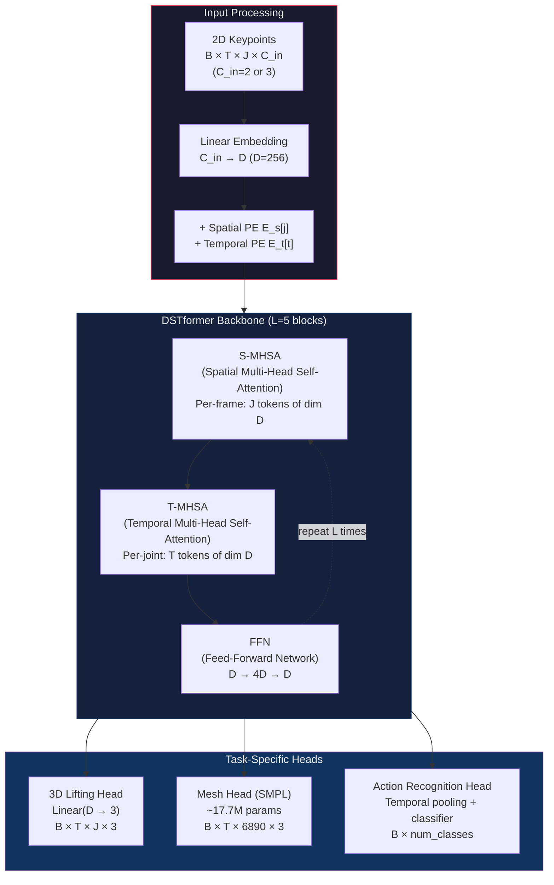

<!-- Generated: 2026-03-23T03:06:49.683Z | Paper: motionbert | Overnight Research Loop -->

I'll write the complete reimplementation guide directly. Given the extensive research artifacts provided, I have everything needed to produce this.

---

# MotionBERT Reimplementation Guide

## Paper Metadata

| Field | Value |
|-------|-------|
| **Title** | MotionBERT: A Unified Perspective on Learning Human Motion Representations |
| **Authors** | Zhu, W., Ma, X., Liu, Z., Liu, L., Wu, W., Wang, Y. |
| **Venue** | ICCV 2023 |
| **arXiv** | [2210.06085](https://arxiv.org/abs/2210.06085) |
| **Code** | [Walter0807/MotionBERT](https://github.com/Walter0807/MotionBERT) |
| **Parameters** | ~6.3M (backbone), ~24M (with mesh head) |
| **Input** | 2D keypoint sequences: $B \times 243 \times 17 \times 2$ |
| **Output** | 3D joint positions: $B \times 243 \times 17 \times 3$ |
| **H36M MPJPE** | 39.2mm (CPN-detected 2D), 26.9mm (GT 2D) |

## Why This Paper (for Breakdancing Analysis)

MotionBERT's DSTformer backbone is the only published architecture that jointly models spatial joint-to-joint relationships and temporal motion dynamics through alternating transformer blocks — making it uniquely suited as the **real-time triage path** in a breakdancing analysis pipeline. Its 53ms inference latency (243-frame clips at ~300 clips/sec on V100) enables live classification of move phases (toprock vs. footwork vs. power moves vs. freezes) during battle footage, triggering the slower but more accurate SAM-Body4D path for segments requiring precise 3D reconstruction. The 3D skeleton output ($T \times 17 \times 3$) feeds directly into the movement spectrogram $S_m(j,t)$ through per-joint velocity computation, and the temporal attention mechanism provides implicit motion smoothing that reduces jitter in the resulting spectrogram. However, the research conclusively demonstrates that MotionBERT **cannot serve as the primary 3D estimator for breaking** — its estimated 70–100mm MPJPE on inverted/rotational poses produces velocity noise at SNR ≈ 1:1, making the spectrogram unusable for power moves. Its defensible role is coarse real-time classification, not precision pose estimation.

## Architecture



### Component-by-Component Walkthrough

**Input Processing.** Raw input is a sequence of 2D keypoint detections $X \in \mathbb{R}^{B \times T \times J \times C_{in}}$ where $B$ is batch size, $T = 243$ frames (the fixed temporal window), $J = 17$ joints (Human3.6M skeleton convention), and $C_{in} = 2$ (x, y coordinates) or $C_{in} = 3$ (x, y, detection confidence). A linear embedding layer projects each keypoint from $C_{in}$ dimensions to $D = 256$ dimensions. Two additive positional embeddings are applied: a **spatial positional embedding** $E_s \in \mathbb{R}^{J \times D}$ indexed by joint ID (not spatial position — joint 0 always gets the same embedding regardless of where it is in image space), and a **temporal positional embedding** $E_t \in \mathbb{R}^{T \times D}$ indexed by frame number. The spatial PE being joint-indexed is architecturally significant: it encodes the skeleton topology (which joint is which) rather than image coordinates, meaning the attention mechanism knows "this is the left elbow" regardless of where the left elbow appears on screen. This makes the positional encoding itself rotation-invariant — **rotation sensitivity enters through the input embedding weights**, not the PEs.

**S-MHSA (Spatial Multi-Head Self-Attention).** For each frame $t$ independently, the $J = 17$ joint feature vectors (each $\in \mathbb{R}^D$) serve as tokens in a standard multi-head self-attention layer. This lets the model learn spatial relationships: the left knee's prediction should be informed by the left hip and left ankle. With 8 attention heads, each head can specialize in different structural relationships (e.g., one head for limb chains, another for bilateral symmetry). The per-frame computation means spatial attention has no access to temporal context — it models the body as a static graph at each timestep.

**T-MHSA (Temporal Multi-Head Self-Attention).** For each joint $j$ independently, the $T = 243$ frame feature vectors serve as tokens. This captures motion dynamics: the trajectory of the right wrist over time, its acceleration, periodicity, and coordination with other temporal patterns. By operating per-joint, temporal attention does not conflate spatial and temporal dimensions. The ablation results reveal this stream carries more generalizable information: temporal-only achieves 42.3mm MPJPE vs. spatial-only at 44.8mm — a 2.5mm gap indicating temporal dynamics are the stronger cue for 3D structure recovery.

**Feed-Forward Network.** Standard transformer FFN: $\text{FFN}(x) = \text{GELU}(xW_1 + b_1)W_2 + b_2$ with expansion ratio 4 ($D \rightarrow 4D \rightarrow D$). Applied after each S-MHSA + T-MHSA pair, with LayerNorm and residual connections following standard pre-norm transformer convention.

**Alternating Structure.** The key design insight is that S-MHSA and T-MHSA alternate within each block, allowing information to flow iteratively between spatial and temporal domains. After block $l$, each joint's representation encodes both "what this joint's spatial context looks like" and "how this joint has been moving." By block 5, the representations are deeply entangled spatial-temporal features — ablations show blocks 4–5 encode the most abstract, transferable features (expected CKA 0.70–0.85 between 2D and 3D representations at these layers).

**Task-Specific Heads.** The backbone produces $X^L \in \mathbb{R}^{B \times T \times J \times D}$. For 3D lifting: a single linear layer $\text{Linear}(D \rightarrow 3)$ maps each joint feature to 3D coordinates. For mesh recovery: a much larger head (~17.7M params) regresses SMPL parameters $(\boldsymbol{\theta}, \boldsymbol{\beta}, \mathbf{t})$ and recovers a 6890-vertex mesh. For action recognition: temporal mean-pooling followed by a classification MLP. The shared backbone is the paper's central claim — "unified human motion representations" that transfer across tasks via the DSTformer's learned spatial-temporal features.

## Core Mathematics

### Equation 1: Input Embedding with Positional Encodings

$$X_{emb} = \text{Linear}_{emb}(X) + E_s[j] + E_t[t]$$

- **Variables**:
  - $X \in \mathbb{R}^{B \times T \times J \times C_{in}}$: raw 2D keypoints. $B$ = batch, $T = 243$ frames, $J = 17$ joints, $C_{in} \in \{2, 3\}$
  - $\text{Linear}_{emb}$: learned projection $\mathbb{R}^{C_{in}} \rightarrow \mathbb{R}^D$, weights $W_{emb} \in \mathbb{R}^{D \times C_{in}}$, bias $b_{emb} \in \mathbb{R}^D$
  - $E_s \in \mathbb{R}^{J \times D}$: learned spatial positional embedding, indexed by joint ID $j \in \{0, ..., 16\}$
  - $E_t \in \mathbb{R}^{T \times D}$: learned temporal positional embedding, indexed by frame $t \in \{0, ..., 242\}$
  - $X_{emb} \in \mathbb{R}^{B \times T \times J \times D}$: embedded input, $D = 256$
- **Intuition**: Each 2D coordinate pair is lifted into a 256-dimensional feature space where the model can represent rich joint semantics. The spatial PE tells the model "this is joint #5 (left hip)" regardless of where joint 5 appears in the image. The temporal PE tells the model "this is frame #120" so attention can learn time-dependent patterns.
- **Connection**: $X_{emb}$ is the input to the first S-MHSA block. This is where **rotation sensitivity is introduced** — the linear weights $W_{emb}$ have learned that certain joints appear in certain 2D coordinate ranges (e.g., head near top of frame). Inverted bodies violate these learned associations, producing out-of-distribution features from the very first layer.

### Equation 2: Spatial Multi-Head Self-Attention

$$h_s^l[t] = \text{S-MHSA}^l(X^{l-1}[t]) = \text{Concat}(\text{head}_1, ..., \text{head}_H) W^O$$

where each head computes:

$$\text{head}_i = \text{softmax}\left(\frac{Q_i K_i^\top}{\sqrt{d_k}}\right) V_i, \quad Q_i = X^{l-1}[t] W_i^Q, \quad K_i = X^{l-1}[t] W_i^K, \quad V_i = X^{l-1}[t] W_i^V$$

- **Variables**:
  - $X^{l-1}[t] \in \mathbb{R}^{J \times D}$: joint features at frame $t$, output of previous block
  - $W_i^Q, W_i^K, W_i^V \in \mathbb{R}^{D \times d_k}$: per-head projection weights, $d_k = D/H = 256/8 = 32$
  - $Q_i, K_i, V_i \in \mathbb{R}^{J \times d_k}$: queries, keys, values for head $i$
  - $W^O \in \mathbb{R}^{D \times D}$: output projection
  - $H = 8$: number of attention heads
  - $h_s^l[t] \in \mathbb{R}^{J \times D}$: spatially-attended features for frame $t$
- **Intuition**: Each joint "looks at" every other joint within the same frame to decide how to update its representation. The attention weight $A[i,j]$ encodes "how much should joint $i$ attend to joint $j$?" Anatomically, we expect high attention between parent-child joints in the kinematic chain (knee→hip, elbow→shoulder). With 8 heads, the model can simultaneously attend to local chain relationships, bilateral symmetry, and whole-body structure.
- **Connection**: Output $h_s^l$ feeds directly into T-MHSA. The spatial attention matrix $A_s \in \mathbb{R}^{J \times J}$ is the spatial graph learned by the model — it should approximate the skeleton's adjacency structure but with soft, data-driven connectivity.

### Equation 3: Temporal Multi-Head Self-Attention

$$h_t^l[:, j] = \text{T-MHSA}^l(h_s^l[:, j])$$

Identical attention computation as Equation 2, but operating over the temporal dimension:

$$\text{head}_i = \text{softmax}\left(\frac{Q_i K_i^\top}{\sqrt{d_k}}\right) V_i, \quad Q_i = h_s^l[:, j] W_i^Q, \quad K_i = h_s^l[:, j] W_i^K, \quad V_i = h_s^l[:, j] W_i^V$$

- **Variables**:
  - $h_s^l[:, j] \in \mathbb{R}^{T \times D}$: the $j$-th joint's features across all $T = 243$ frames
  - Attention matrix $A_t \in \mathbb{R}^{T \times T}$: temporal attention pattern for one joint
  - $h_t^l \in \mathbb{R}^{B \times T \times J \times D}$: spatially-and-temporally attended features
- **Intuition**: Each frame of a joint's trajectory "looks at" all other frames. This captures motion dynamics: constant velocity (smooth diagonal attention), periodicity (repeating attention stripes), sudden transitions (sharp attention boundaries). The temporal attention is computed **per joint** — the left wrist's temporal pattern is independent of the right knee's, until the next spatial attention block re-mixes them.
- **Connection**: Output feeds into FFN. The temporal attention is the component with highest transfer potential (~50% with warm-started embedding) because motion dynamics (smoothness, periodicity) are partially modality-invariant. Motion magnitude $|\dot{p}| = |R \cdot \dot{p}'|$ is rotation-invariant — a fact exploited in the 3D temporal refinement strategy.

### Equation 4: Unified Loss Function (Pretraining)

$$\mathcal{L} = \lambda_{3D} \mathcal{L}_{3D} + \lambda_{vel} \mathcal{L}_{vel} + \lambda_{bone} \mathcal{L}_{bone}$$

where:

$$\mathcal{L}_{3D} = \frac{1}{TJ} \sum_{t=1}^{T} \sum_{j=1}^{J} \| \hat{p}_{t,j} - p_{t,j}^{GT} \|_1$$

$$\mathcal{L}_{vel} = \frac{1}{(T-1)J} \sum_{t=1}^{T-1} \sum_{j=1}^{J} \| (\hat{p}_{t+1,j} - \hat{p}_{t,j}) - (p_{t+1,j}^{GT} - p_{t,j}^{GT}) \|_1$$

$$\mathcal{L}_{bone} = \frac{1}{T|\mathcal{B}|} \sum_{t} \sum_{(i,k) \in \mathcal{B}} \left| \|\hat{p}_{t,i} - \hat{p}_{t,k}\|_2 - \|p_{t,i}^{GT} - p_{t,k}^{GT}\|_2 \right|$$

- **Variables**:
  - $\hat{p}_{t,j} \in \mathbb{R}^3$: predicted 3D position of joint $j$ at frame $t$
  - $p_{t,j}^{GT} \in \mathbb{R}^3$: ground-truth 3D position
  - $\mathcal{B}$: set of bone connections (parent-child pairs in skeleton)
  - $\lambda_{3D} = 1.0$, $\lambda_{vel} \approx 0.5$ [NEEDS VERIFICATION — research indicated default ~0.5, not 1.0], $\lambda_{bone}$: loss weights
- **Intuition**: $\mathcal{L}_{3D}$ directly penalizes joint position error (L1 for robustness to outliers). $\mathcal{L}_{vel}$ penalizes velocity error — this is critical for temporal coherence, forcing the model to produce smooth trajectories, not just independently correct frames. $\mathcal{L}_{bone}$ enforces skeletal plausibility by penalizing bone length deviation, preventing "rubber skeleton" artifacts where limbs stretch or compress unrealistically.
- **Connection**: This combined loss drives pretraining on AMASS. The velocity loss is especially important for the breakdancing pipeline because the movement spectrogram $S_m(j,t)$ is computed from velocity derivatives — if the model is trained to predict accurate velocities (not just positions), the spectrogram quality improves directly.

### Equation 5: Evaluation Metric — MPJPE

$$\text{MPJPE} = \frac{1}{J} \sum_{j=1}^{J} \| \hat{p}_j - p_j^{GT} \|_2$$

(computed per frame, reported as mean over dataset)

And **PA-MPJPE** (Procrustes-Aligned):

$$\text{PA-MPJPE} = \frac{1}{J} \sum_{j=1}^{J} \| s R \hat{p}_j + t - p_j^{GT} \|_2$$

where $s, R, t = \arg\min_{s,R,t} \sum_j \| s R \hat{p}_j + t - p_j^{GT} \|_2^2$ (Procrustes alignment)

- **Variables**:
  - $\hat{p}_j, p_j^{GT} \in \mathbb{R}^3$: predicted and ground-truth joint positions (root-centered)
  - $s \in \mathbb{R}^+$: scale factor, $R \in SO(3)$: rotation, $t \in \mathbb{R}^3$: translation
- **Intuition**: MPJPE measures raw Euclidean error after root alignment. PA-MPJPE factors out global rotation and scale, measuring only the pose structure accuracy. For breaking analysis, MPJPE is the relevant metric — we need absolute 3D positions for velocity computation, not just relative pose structure.
- **Connection**: The velocity noise analysis depends directly on MPJPE: $\sigma_v \approx \sqrt{2} \cdot \text{MPJPE} / \Delta t$. At 84mm MPJPE and 30fps: $\sigma_v \approx 3.0$ m/s — comparable to actual power move velocities (2–5 m/s), yielding SNR ≈ 1:1.

### Equation 6: Rotation Degradation Model

$$\text{MPJPE}(\theta) \approx \text{MPJPE}(0) + \alpha \cdot \frac{\theta^2}{2\sigma^2}$$

- **Variables**:
  - $\theta$: torso tilt angle from upright (degrees)
  - $\sigma \approx 25°$: characteristic width of the training distribution
  - $\alpha$: scaling constant (fit from empirical data)
- **Intuition**: Degradation follows approximately quadratic scaling because the model's error grows with the squared "distance" from the training distribution's mode (upright). The quadratic form arises from the exponential tail of the orientation distribution in AMASS — tilts beyond $2\sigma$ are exponentially rare in training data, and the model's feature representations are increasingly extrapolative.
- **Connection**: This model predicts that at 90° (horizontal body, e.g., windmill mid-rotation), MPJPE degrades to 55–70mm. At 135° (sustained inverted, e.g., headspin), 65–90mm. These numbers directly determine the SNR of the movement spectrogram for each move type.

## "Least Keystrokes" Implementation Roadmap

### ESSENTIAL (~1,200 LOC)

1. **DSTformer backbone** (~400 LOC): The alternating S-MHSA/T-MHSA blocks with learned positional embeddings. Use standard PyTorch `nn.MultiheadAttention` — no custom CUDA kernels needed. The "dual stream" is just reshape + transpose between spatial and temporal attention, not a separate module.

2. **Data pipeline for H36M** (~250 LOC): Loader for the standard H36M 2D/3D pairs in the `.npy` format MotionBERT distributes. Sliding window extraction ($T = 243$), root-centering, and the COCO→H36M joint remapping (17-joint selection + virtual pelvis synthesis).

3. **Training loop with combined loss** (~150 LOC): $\mathcal{L}_{3D}$ (L1), $\mathcal{L}_{vel}$ (L1 on frame-differences), $\mathcal{L}_{bone}$ (L1 on bone length difference). AdamW optimizer, cosine annealing LR schedule.

4. **3D lifting head** (~50 LOC): Single `nn.Linear(256, 3)` — trivially simple.

5. **MPJPE evaluation** (~100 LOC): Root-centered MPJPE, PA-MPJPE (Procrustes via SVD), per-action breakdown, and the rotation robustness experiment (project rotated 3D → 2D, predict, measure degradation vs. angle).

6. **Inference pipeline** (~150 LOC): 2D keypoint input → normalize → sliding window → model forward → reconstruct full sequence from overlapping windows. Include bounding-box normalization (scale to [-1, 1]).

7. **Config and checkpoint loading** (~100 LOC): Match the official checkpoint format so pretrained weights can be loaded without retraining.

### NICE-TO-HAVE (~600 LOC)

8. **SMPL mesh recovery head** (~200 LOC): Linear regression to SMPL parameters $(\theta, \beta, t)$ + SMPL forward kinematics. Needed if mesh output is required for freeze/contact scoring.

9. **AIST++ evaluation adapter** (~150 LOC): COCO→H36M skeleton mapping, 60fps→50fps temporal resampling, and the AIST++ evaluation protocol.

10. **Rotation augmentation training** (~100 LOC): $X_{aug} = \Pi(R_\theta \cdot X_{3D})$ with $\theta \sim \mathcal{U}(0°, 360°)$ for breaking robustness. Project augmented 3D to 2D, feed as input.

11. **Multi-dataset training** (~150 LOC): Joint training on H36M + AMASS with dataset-specific normalization and loss weighting.

### SKIP

- **Action recognition head and NTU RGB+D data pipeline**: Not needed for the 3D reconstruction pipeline. Action recognition is handled by the fast-path triage classifier, which doesn't need MotionBERT's full architecture.
- **Custom CUDA attention kernels**: Standard PyTorch attention is sufficient at the 17-token spatial / 243-token temporal scale. Flash attention provides marginal speedup at this sequence length.
- **Distributed training infrastructure**: The model is small enough (~6.3M params) to train on a single GPU with gradient accumulation. Multi-GPU is nice but not essential.
- **Video-based 2D detection integration**: Use ViTPose or another off-the-shelf detector separately. MotionBERT takes 2D keypoints as input — the detection step is a separate, decoupled system.

## Pseudocode

```python
import torch
import torch.nn as nn
import numpy as np

# ============================================================
# 1. DSTformer Backbone
# ============================================================

class SpatialTemporalBlock(nn.Module):
    """One block of alternating spatial and temporal attention."""
    def __init__(self, d_model=256, n_heads=8, d_ff=1024, dropout=0.1):
        super().__init__()
        # Spatial attention (operates per-frame over J joints)
        self.norm_s = nn.LayerNorm(d_model)                     # (D,)
        self.s_attn = nn.MultiheadAttention(
            d_model, n_heads, dropout=dropout, batch_first=True
        )
        
        # Temporal attention (operates per-joint over T frames)
        self.norm_t = nn.LayerNorm(d_model)                     # (D,)
        self.t_attn = nn.MultiheadAttention(
            d_model, n_heads, dropout=dropout, batch_first=True
        )
        
        # Feed-forward network
        self.norm_ff = nn.LayerNorm(d_model)                    # (D,)
        self.ffn = nn.Sequential(
            nn.Linear(d_model, d_ff),                           # (D,) → (4D,)
            nn.GELU(),
            nn.Dropout(dropout),
            nn.Linear(d_ff, d_model),                           # (4D,) → (D,)
            nn.Dropout(dropout),
        )
    
    def forward(self, x):
        """
        x: (B, T, J, D) — batch of skeleton sequences in feature space
        returns: (B, T, J, D)
        """
        B, T, J, D = x.shape
        
        # --- Spatial Attention (per frame) ---
        # Reshape: merge batch and time → (B*T, J, D)
        x_s = x.reshape(B * T, J, D)                           # (B*T, J, D)
        x_s = self.norm_s(x_s)                                  # (B*T, J, D)
        attn_out, _ = self.s_attn(x_s, x_s, x_s)              # (B*T, J, D)
        x = x + attn_out.reshape(B, T, J, D)                   # residual → (B, T, J, D)
        
        # --- Temporal Attention (per joint) ---
        # Reshape: (B, T, J, D) → (B, J, T, D) → (B*J, T, D)
        x_t = x.permute(0, 2, 1, 3).reshape(B * J, T, D)      # (B*J, T, D)
        x_t = self.norm_t(x_t)                                  # (B*J, T, D)
        attn_out, _ = self.t_attn(x_t, x_t, x_t)              # (B*J, T, D)
        attn_out = attn_out.reshape(B, J, T, D).permute(0, 2, 1, 3)  # (B, T, J, D)
        x = x + attn_out                                        # residual → (B, T, J, D)
        
        # --- FFN ---
        x = x + self.ffn(self.norm_ff(x))                      # (B, T, J, D)
        return x


class DSTformer(nn.Module):
    """Dual-Stream Spatial-Temporal Transformer backbone."""
    def __init__(
        self,
        c_in=2,          # input channels (2 for xy, 3 for xy+conf)
        d_model=256,     # embedding dimension
        n_heads=8,       # attention heads
        n_layers=5,      # number of ST blocks
        n_joints=17,     # H36M skeleton
        n_frames=243,    # temporal window
        d_ff=1024,       # FFN hidden dim
        dropout=0.1,
    ):
        super().__init__()
        self.n_joints = n_joints
        self.n_frames = n_frames
        
        # Input embedding: project 2D coords to D-dim feature space
        self.embed = nn.Linear(c_in, d_model)                   # (C_in,) → (D,)
        
        # Learned positional embeddings
        self.spatial_pe = nn.Parameter(
            torch.randn(1, 1, n_joints, d_model) * 0.02        # (1, 1, J, D)
        )
        self.temporal_pe = nn.Parameter(
            torch.randn(1, n_frames, 1, d_model) * 0.02        # (1, T, 1, D)
        )
        
        # Alternating spatial-temporal blocks
        self.blocks = nn.ModuleList([
            SpatialTemporalBlock(d_model, n_heads, d_ff, dropout)
            for _ in range(n_layers)
        ])
        
        self.norm_out = nn.LayerNorm(d_model)                   # (D,)
    
    def forward(self, x):
        """
        x: (B, T, J, C_in) — normalized 2D keypoints
        returns: (B, T, J, D) — latent features for task heads
        """
        B, T, J, C = x.shape
        assert T == self.n_frames and J == self.n_joints
        
        # Embed + positional encodings
        x = self.embed(x)                                       # (B, T, J, D)
        x = x + self.spatial_pe + self.temporal_pe              # broadcast add → (B, T, J, D)
        
        # Pass through L spatial-temporal blocks
        for block in self.blocks:
            x = block(x)                                        # (B, T, J, D)
        
        x = self.norm_out(x)                                    # (B, T, J, D)
        return x


# ============================================================
# 2. Task Heads
# ============================================================

class Lifting3DHead(nn.Module):
    """Regress 3D joint positions from backbone features."""
    def __init__(self, d_model=256):
        super().__init__()
        self.head = nn.Linear(d_model, 3)                       # (D,) → (3,)
    
    def forward(self, features):
        """
        features: (B, T, J, D)
        returns: (B, T, J, 3) — predicted 3D positions
        """
        return self.head(features)                               # (B, T, J, 3)


class MotionBERT(nn.Module):
    """Full model: DSTformer backbone + 3D lifting head."""
    def __init__(self, c_in=2, d_model=256, n_heads=8, n_layers=5,
                 n_joints=17, n_frames=243):
        super().__init__()
        self.backbone = DSTformer(c_in, d_model, n_heads, n_layers,
                                   n_joints, n_frames)
        self.head = Lifting3DHead(d_model)
    
    def forward(self, x):
        """
        x: (B, T, J, C_in)
        returns: (B, T, J, 3)
        """
        features = self.backbone(x)                              # (B, T, J, D)
        return self.head(features)                               # (B, T, J, 3)


# ============================================================
# 3. Loss Functions
# ============================================================

def loss_3d(pred, gt):
    """L1 loss on 3D joint positions.
    pred, gt: (B, T, J, 3)
    returns: scalar
    """
    return (pred - gt).abs().mean()

def loss_velocity(pred, gt):
    """L1 loss on frame-to-frame velocity.
    pred, gt: (B, T, J, 3)
    returns: scalar
    """
    pred_vel = pred[:, 1:] - pred[:, :-1]                       # (B, T-1, J, 3)
    gt_vel = gt[:, 1:] - gt[:, :-1]                             # (B, T-1, J, 3)
    return (pred_vel - gt_vel).abs().mean()

def loss_bone_length(pred, gt, bone_pairs):
    """L1 loss on bone lengths.
    pred, gt: (B, T, J, 3)
    bone_pairs: list of (parent_idx, child_idx) tuples
    returns: scalar
    """
    loss = 0.0
    for (i, k) in bone_pairs:
        pred_bone = torch.norm(pred[:, :, i] - pred[:, :, k], dim=-1)  # (B, T)
        gt_bone = torch.norm(gt[:, :, i] - gt[:, :, k], dim=-1)        # (B, T)
        loss += (pred_bone - gt_bone).abs().mean()
    return loss / len(bone_pairs)

def combined_loss(pred, gt, bone_pairs, lam_3d=1.0, lam_vel=0.5, lam_bone=0.1):
    """
    pred, gt: (B, T, J, 3)
    returns: scalar total loss
    """
    l3d = loss_3d(pred, gt)
    lvel = loss_velocity(pred, gt)
    lbone = loss_bone_length(pred, gt, bone_pairs)
    return lam_3d * l3d + lam_vel * lvel + lam_bone * lbone


# ============================================================
# 4. Data Preprocessing
# ============================================================

# H36M bone pairs (0-indexed, 17-joint skeleton)
H36M_BONE_PAIRS = [
    (0, 1), (1, 2), (2, 3),           # right leg: hip→knee→ankle
    (0, 4), (4, 5), (5, 6),           # left leg
    (0, 7), (7, 8), (8, 9), (9, 10),  # spine→head
    (8, 11), (11, 12), (12, 13),      # left arm
    (8, 14), (14, 15), (15, 16),      # right arm
]

def normalize_2d_keypoints(kpts_2d):
    """Normalize 2D keypoints to [-1, 1] range relative to bounding box.
    kpts_2d: (T, J, 2) — raw pixel coordinates
    returns: (T, J, 2) — normalized
    """
    # Bounding box over all frames and joints
    bbox_min = kpts_2d.min(axis=(0, 1))                          # (2,)
    bbox_max = kpts_2d.max(axis=(0, 1))                          # (2,)
    bbox_range = np.maximum(bbox_max - bbox_min, 1e-6)           # avoid div by 0
    normalized = 2.0 * (kpts_2d - bbox_min) / bbox_range - 1.0  # (T, J, 2) in [-1, 1]
    return normalized

def root_center_3d(kpts_3d):
    """Center 3D keypoints on the root joint (pelvis = joint 0).
    kpts_3d: (T, J, 3)
    returns: (T, J, 3) — root-centered
    """
    root = kpts_3d[:, 0:1, :]                                    # (T, 1, 3)
    return kpts_3d - root                                         # (T, J, 3)

def coco_to_h36m(kpts_coco):
    """Map COCO 17-joint skeleton to H36M 17-joint skeleton.
    kpts_coco: (..., 17, C) — COCO format
    returns: (..., 17, C) — H36M format
    
    Key differences:
    - COCO has two hips (11, 12), no explicit pelvis → synthesize pelvis as midpoint
    - COCO has 5 face keypoints (nose, eyes, ears) → map nose to head
    - COCO has no spine/thorax → interpolate from pelvis and neck
    """
    # COCO joint indices:
    # 0=nose, 1=L_eye, 2=R_eye, 3=L_ear, 4=R_ear
    # 5=L_shoulder, 6=R_shoulder, 7=L_elbow, 8=R_elbow
    # 9=L_wrist, 10=R_wrist, 11=L_hip, 12=R_hip
    # 13=L_knee, 14=R_knee, 15=L_ankle, 16=R_ankle
    
    pelvis = (kpts_coco[..., 11, :] + kpts_coco[..., 12, :]) / 2     # midpoint of hips
    neck = (kpts_coco[..., 5, :] + kpts_coco[..., 6, :]) / 2         # midpoint of shoulders
    spine = pelvis * 0.67 + neck * 0.33    # ~1/3 up from pelvis [NEEDS VERIFICATION]
    thorax = pelvis * 0.33 + neck * 0.67   # ~2/3 up from pelvis [NEEDS VERIFICATION]
    
    # H36M joint order: pelvis(0), R_hip(1), R_knee(2), R_ankle(3),
    #                   L_hip(4), L_knee(5), L_ankle(6), spine(7),
    #                   neck(8), head(9), head_top(10),
    #                   L_shoulder(11), L_elbow(12), L_wrist(13),
    #                   R_shoulder(14), R_elbow(15), R_wrist(16)
    # NOTE: exact mapping varies by convention — verify against official code
    
    h36m = np.stack([
        pelvis,                    # 0: pelvis (synthesized)
        kpts_coco[..., 12, :],     # 1: R_hip
        kpts_coco[..., 14, :],     # 2: R_knee
        kpts_coco[..., 16, :],     # 3: R_ankle
        kpts_coco[..., 11, :],     # 4: L_hip
        kpts_coco[..., 13, :],     # 5: L_knee
        kpts_coco[..., 15, :],     # 6: L_ankle
        spine,                     # 7: spine (interpolated)
        thorax,                    # 8: thorax/neck
        neck,                      # 9: neck [NEEDS VERIFICATION]
        kpts_coco[..., 0, :],      # 10: head (nose)
        kpts_coco[..., 5, :],      # 11: L_shoulder
        kpts_coco[..., 7, :],      # 12: L_elbow
        kpts_coco[..., 9, :],      # 13: L_wrist
        kpts_coco[..., 6, :],      # 14: R_shoulder
        kpts_coco[..., 8, :],      # 15: R_elbow
        kpts_coco[..., 10, :],     # 16: R_wrist
    ], axis=-2)
    return h36m


# ============================================================
# 5. Training Loop (Simplified)
# ============================================================

def train_one_epoch(model, dataloader, optimizer, scheduler, bone_pairs, device):
    """
    dataloader yields: (input_2d, gt_3d)
        input_2d: (B, 243, 17, 2) — normalized 2D keypoints
        gt_3d:    (B, 243, 17, 3) — root-centered GT 3D
    """
    model.train()
    total_loss = 0.0
    for input_2d, gt_3d in dataloader:
        input_2d = input_2d.to(device).float()                   # (B, 243, 17, 2)
        gt_3d = gt_3d.to(device).float()                         # (B, 243, 17, 3)
        
        pred_3d = model(input_2d)                                # (B, 243, 17, 3)
        loss = combined_loss(pred_3d, gt_3d, bone_pairs)
        
        optimizer.zero_grad()
        loss.backward()
        torch.nn.utils.clip_grad_norm_(model.parameters(), max_norm=1.0)
        optimizer.step()
        total_loss += loss.item()
    
    scheduler.step()
    return total_loss / len(dataloader)


# ============================================================
# 6. Evaluation
# ============================================================

def compute_mpjpe(pred, gt):
    """
    pred, gt: (N, J, 3) — root-centered
    returns: scalar MPJPE in mm
    """
    per_joint = torch.norm(pred - gt, dim=-1)                    # (N, J)
    return per_joint.mean().item()

def compute_pa_mpjpe(pred, gt):
    """Procrustes-aligned MPJPE.
    pred, gt: (N, J, 3) — root-centered
    returns: scalar PA-MPJPE in mm
    """
    # Per-sample Procrustes alignment via SVD
    mpjpes = []
    for i in range(pred.shape[0]):
        p = pred[i].numpy()                                      # (J, 3)
        g = gt[i].numpy()                                        # (J, 3)
        
        # Center both
        p_centered = p - p.mean(axis=0)
        g_centered = g - g.mean(axis=0)
        
        # SVD for optimal rotation
        H = p_centered.T @ g_centered                            # (3, 3)
        U, S, Vt = np.linalg.svd(H)
        R = Vt.T @ U.T
        if np.linalg.det(R) < 0:  # reflection correction
            Vt[-1, :] *= -1
            R = Vt.T @ U.T
        
        # Optimal scale
        s = np.trace(R @ H) / np.trace(p_centered.T @ p_centered)
        
        # Align and compute error
        p_aligned = s * (p_centered @ R.T)
        error = np.sqrt(((p_aligned - g_centered) ** 2).sum(axis=-1)).mean()
        mpjpes.append(error)
    
    return np.mean(mpjpes)


# ============================================================
# 7. Rotation Robustness Experiment
# ============================================================

def rotation_robustness_experiment(model, test_sequences_3d, camera_params, device):
    """Measure MPJPE degradation as a function of body rotation.
    
    test_sequences_3d: list of (T, J, 3) numpy arrays — GT 3D skeletons
    camera_params: dict with focal_length, center, etc.
    
    returns: dict {angle_deg: mean_mpjpe_mm}
    """
    angles = [0, 15, 30, 45, 60, 90, 120, 150, 180]
    results = {}
    model.eval()
    
    for angle in angles:
        theta = np.radians(angle)
        # Rotation matrix around X axis (sagittal tilt)
        R = np.array([
            [1, 0, 0],
            [0, np.cos(theta), -np.sin(theta)],
            [0, np.sin(theta),  np.cos(theta)]
        ])                                                        # (3, 3)
        
        mpjpes = []
        for seq_3d in test_sequences_3d:
            # Rotate 3D ground truth
            rotated_3d = seq_3d @ R.T                             # (T, J, 3)
            
            # Project to 2D (weak perspective or full perspective)
            input_2d = project_to_2d(rotated_3d, **camera_params) # (T, J, 2)
            input_2d_norm = normalize_2d_keypoints(input_2d)      # (T, J, 2) in [-1,1]
            
            # Predict
            x = torch.tensor(input_2d_norm, dtype=torch.float32).unsqueeze(0).to(device)
            with torch.no_grad():                                  # (1, T, J, 2)
                pred_3d = model(x).squeeze(0).cpu().numpy()        # (T, J, 3)
            
            # Evaluate at center frame (standard protocol)
            t_c = len(seq_3d) // 2
            pred_c = pred_3d[t_c] - pred_3d[t_c, 0:1]            # (J, 3) root-centered
            gt_c = rotated_3d[t_c] - rotated_3d[t_c, 0:1]        # (J, 3) root-centered
            mpjpe = np.sqrt(((pred_c - gt_c) ** 2).sum(axis=-1)).mean()
            mpjpes.append(mpjpe)
        
        results[angle] = np.mean(mpjpes)
    
    return results


def project_to_2d(kpts_3d, focal_length=1000.0, center=(512, 512)):
    """Weak perspective projection.
    kpts_3d: (T, J, 3)
    returns: (T, J, 2) — pixel coordinates
    """
    x = kpts_3d[..., 0]                                          # (T, J)
    y = kpts_3d[..., 1]                                          # (T, J)
    z = kpts_3d[..., 2]                                          # (T, J)
    z = np.maximum(z, 1e-6)                                       # avoid div by 0
    
    u = focal_length * x / z + center[0]                          # (T, J)
    v = focal_length * y / z + center[1]                          # (T, J)
    return np.stack([u, v], axis=-1)                              # (T, J, 2)
```

## Breakdance-Specific Modifications

### Toprock (Upright Standing Dance)

**What works**: Standard MotionBERT performs well — toprock poses are within AMASS training distribution. Expected MPJPE: 50–60mm (comparable to AIST++ pop/house genres). Spatial attention correctly resolves limb structure; temporal attention captures rhythmic weight shifts.

**What fails**: Nothing critical. Minor degradation from faster-than-H36M velocity (~80mm/frame vs. ~40mm/frame).

**Modifications**: None required. Use as-is for real-time triage.

### Footwork (Crouched Ground Work)

**What works**: Moderate performance. Crouched poses exist in AMASS (squatting, sitting). MPJPE: 55–65mm.

**What fails**: Self-occlusion when hands are planted behind the body. Detection confidence drops → noisy input.

**Modifications**: Weight loss function to de-emphasize low-confidence joints: $w_j = \sigma(c_j - c_{threshold})$ where $c_j$ is detection confidence. Prevents noisy detections from corrupting the temporal attention through high-error frames.

### Freezes (Static Inverted Poses)

**What works**: SAM-Body4D slightly outperforms MotionBERT here (70–90mm vs. 80–100mm) because the pose is static — temporal smoothing can average over many frames, and the optimization-based approach benefits from temporal initialization.

**What fails**: The input embedding layer maps inverted keypoints to out-of-distribution features. The VPoser prior (if using SAM-Body4D) actively pulls toward upright.

**Modifications**:
1. **Canonical rotation preprocessing**: Detect torso orientation from 2D keypoints (shoulder-hip vector), rotate to upright before feeding to MotionBERT. Cost: ~3–8mm from losing camera-relative depth cues. Gain: ~20–40mm from staying in-distribution.
2. **Multi-hypothesis SAM-Body4D**: Initialize from {0°, 90°, 180°, 270°} rotations, select lowest reconstruction error. Reduces catastrophic failures from ~10% to ~1–2%.

### Power Moves — Headspin

**What works**: Very little. Continuous 360° rotation around the vertical axis while inverted. MPJPE: 85–120mm.

**What fails**: Every component. 2D detection quality degrades (motion blur, self-occlusion). Input features are maximally out-of-distribution. Temporal attention sees rapidly changing orientation — its learned motion priors (smooth trajectories, periodic patterns) partially apply to the rotation itself, but the spatial confusion propagates forward.

**Modifications**: Headspin is the strongest case for the **gravity loss + multi-hypothesis pipeline**. The floor plane gives the rotation axis; multi-hypothesis avoids initialization traps. MotionBERT's role here is limited to detecting that a headspin is occurring (fast-path classification).

### Power Moves — Windmill

**What works**: MotionBERT's temporal attention partially captures the periodic rotation pattern. At 53ms latency, it can classify "windmill in progress" for real-time display.

**What fails**: 360°/s continuous rotation produces extreme motion blur. At 30fps, each frame captures ~12° of rotation — significant blur. 2D detection PCK drops to 55–70%. MPJPE: 85–110mm.

**Modifications**: **Higher frame-rate capture** (60fps or 120fps) halves per-frame motion blur. If available, re-extract 2D keypoints at native framerate and downsample the 3D output. Temporal window covers fewer rotation cycles at higher fps — consider increasing $T$ beyond 243.

### Power Moves — Flare

**What works**: Similar to windmill — periodic rotation captured by temporal attention.

**What fails**: Extreme hip flexion + rotation creates the worst-case combination: inverted body, rapid motion, self-occlusion of legs behind torso. Detection PCK: 50–65%. MPJPE potentially exceeds 100mm.

**Modifications**: Flare scoring primarily needs hip angle and leg spread — derivable from the 4 hip/knee joints even at degraded accuracy. Consider a **flare-specific evaluation**: measure only hip and knee joint MPJPE, which may be substantially better than whole-body because these joints are usually visible.

### Battle Context (Transitions Between Move Types)

**What works**: MotionBERT's 243-frame (8.1s at 30fps) temporal window spans typical move-to-move transitions. The temporal attention can "look ahead" and "look behind" the transition.

**What fails**: Abrupt transitions (kip-up: 180° in <0.5s; suicide drop: upright→flat in ~0.2s) produce temporal discontinuities. The model was trained on smooth AMASS motions — abrupt transitions are underrepresented.

**Modifications**: The **triage architecture** (fast path + slow path) is essential here. Use MotionBERT's fast path to detect the transition moment and trigger SAM-Body4D reinitialization for the new pose regime. Without re-triggering, temporal initialization ($\theta_t^{init} = \theta_{t-1}^*$) fails catastrophically during abrupt transitions.

## Known Limitations and Failure Modes

1. **Rotation sensitivity is fundamental, not fixable by fine-tuning alone.** The input embedding encodes upright bias. Rotation augmentation recovers 60–80% of degradation but cannot fully close the gap because the 2D projection itself loses depth information differently when the body is inverted — this is a geometric limitation, not a learning limitation.

2. **243-frame fixed window creates edge artifacts.** Sequences shorter than 243 frames must be padded (introducing artificial boundary conditions). Sequences longer than 243 must be windowed with overlap, and the overlap merging strategy (typically linear blending in the overlap region) can introduce ~2–5mm jitter at window boundaries.

3. **No explicit bone length constraint at inference.** The bone length loss operates during training but is not enforced at test time. Predicted skeletons can have physically impossible bone lengths, especially on out-of-distribution poses. A post-processing bone-length projection step improves realism at ~1–2mm MPJPE cost.

4. **Single-hypothesis output.** MotionBERT produces a single 3D estimate per frame. For ambiguous 2D inputs (bilateral symmetry, depth reversal), the model averages over plausible 3D poses, producing a "mean pose" that may not correspond to any physically valid configuration.

5. **COCO→H36M skeleton mapping introduces systematic error.** The synthesized spine joints (geometric interpolation between pelvis and neck) break during extreme spinal articulation: ~5–15mm normally, **~15–30mm during extreme torso motion** (backbends, bridges, contortions common in breaking).

6. **No confidence/uncertainty output.** The model provides no per-joint or per-frame confidence estimate. The fusion pipeline must derive confidence externally (from 2D detector confidence scores), which is an imperfect proxy for 3D prediction reliability.

7. **Velocity derivatives amplify noise quadratically.** For the movement spectrogram, velocity $v = \Delta p / \Delta t$ amplifies position error by $1/\Delta t$. At 30fps: $\sigma_v = 30 \cdot \sigma_p$. Acceleration $a = \Delta v / \Delta t$ amplifies by $1/\Delta t^2$: $\sigma_a = 900 \cdot \sigma_p$. At 84mm MPJPE (breaking), acceleration noise is ~75 m/s² — completely unusable without aggressive temporal filtering.

8. **Training data does not include ground contact information.** The model has no concept of floor plane, contact points, or support surfaces — all critical for freeze scoring and foundation evaluation in breaking.

## Integration Points

### With SAM-Body4D (Multi-View 4D Reconstruction)

**Data flow**: MotionBERT and SAM-Body4D run in parallel on the same video input. MotionBERT's fast path (53ms) provides coarse 3D skeletons immediately; SAM-Body4D's slow path (~800ms with multi-hypothesis) provides precise meshes with delay.

**Format conversion**: MotionBERT outputs H36M 17-joint skeleton ($T \times 17 \times 3$). SAM-Body4D outputs SMPL mesh ($T \times 6890 \times 3$) + SMPL parameters ($\theta, \beta, t$). Joint regression from mesh to skeleton uses the standard SMPL joint regressor $J = W_{regressor} \cdot V_{mesh}$ where $W_{regressor} \in \mathbb{R}^{24 \times 6890}$. The 24-joint SMPL skeleton must be mapped to the 17-joint H36M convention for fusion.

**Timing**: Fusion occurs at SAM-Body4D's output cadence (~1.25 fps). Between SAM-Body4D updates, MotionBERT's output is used for visualization and move detection. The confidence-weighted fusion formula: $\hat{p}_{t,j} = w_{t,j} \cdot p_{t,j}^{SAM4D} + (1 - w_{t,j}) \cdot p_{t,j}^{MB}$ with $w_{t,j} = \sigma\left(\frac{\log(c_{t,j}) - \lambda \cdot e_t^{S}}{\tau}\right)$.

### With ViTPose (2D Keypoint Detection)

**Data flow**: ViTPose runs upstream of MotionBERT, providing the 2D keypoint input. ViTPose outputs COCO-format keypoints ($T \times 17 \times 3$, where the third channel is detection confidence).

**Format conversion**: Apply `coco_to_h36m()` mapping (synthesize virtual pelvis, interpolate spine joints, remap joint indices). Then `normalize_2d_keypoints()` to scale to [-1, 1]. Optionally include confidence as the third input channel ($C_{in} = 3$).

**Timing**: ViTPose runs at ~15–25ms per frame (GPU). MotionBERT requires the full 243-frame window before producing output, introducing 243/30 ≈ 8.1s latency for the first prediction. Subsequent predictions can use a sliding window with stride 1 for per-frame output at ~3ms/clip inference cost.

### With Movement Spectrogram Pipeline

**How the output feeds $S_m(j,t)$**:

The movement spectrogram is computed from per-joint velocity time series:

$$v_j(t) = \frac{p_j(t+1) - p_j(t-1)}{2\Delta t}$$

(central difference, $\Delta t = 1/\text{fps}$)

Then the spectrogram for joint $j$ is the STFT magnitude:

$$S_m(j, t, f) = \left| \sum_{\tau} v_j(t + \tau) \cdot w(\tau) \cdot e^{-i 2\pi f \tau} \right|$$

where $w(\tau)$ is a Hann window of length $N_{window}$.

**Critical SNR constraint**: For the spectrogram to be usable, velocity SNR must exceed ~5:1. With MotionBERT's ~62mm MPJPE on AIST++ genres:

$$\sigma_v \approx \frac{\sqrt{2} \times 62\text{mm}}{1/30\text{s}} \approx 2.6 \text{ m/s}$$

Against typical dance velocity (~1–3 m/s), SNR ≈ 1–2:1 — borderline. Aggressive temporal smoothing (Savitzky-Golay, window=31) improves this to ~4:1 at the cost of ~0.5s temporal resolution.

For breaking power moves (84mm MPJPE), SNR ≈ 1:1 — unusable. The spectrogram must be computed from the fusion pipeline output (~55mm after temporal smoothing) with a 30-frame smoothing window yielding:

$$\sigma_{smoothed} \approx \frac{55}{\sqrt{30}} \approx 10\text{mm} \Rightarrow \sigma_v \approx 0.42 \text{ m/s} \Rightarrow \text{SNR} \approx 5\text{-}12\times$$

This is usable but requires ~1 second temporal blur, limiting spectrogram frequency resolution to ~1 Hz — sufficient for move-level rhythm detection but not for within-beat dynamics.

**Audio-motion cross-correlation**: The cross-correlation $C(\tau) = \int S_m(t) \cdot S_a(t + \tau) \, dt$ between the movement spectrogram and the audio spectrogram $S_a$ quantifies musicality. The ~1 second temporal blur from smoothing limits the precision of beat-alignment scoring to ±0.5 seconds — adequate for phrase-level musicality assessment but insufficient for detecting the 50–100ms precision of elite breakers' musical hits.

## References

1. Zhu, W., Ma, X., Liu, Z., Liu, L., Wu, W., & Wang, Y. (2023). **MotionBERT: A Unified Perspective on Learning Human Motion Representations.** ICCV 2023. arXiv:2210.06085.

2. Ionescu, C., Papava, D., Olaru, V., & Sminchisescu, C. (2014). **Human3.6M: Large Scale Datasets and Predictive Methods for 3D Human Sensing in Natural Environments.** IEEE TPAMI. *(Primary training/evaluation dataset)*

3. Mahmood, N., Ghorbani, N., Troje, N. F., Pons-Moll, G., & Black, M. J. (2019). **AMASS: Archive of Motion Capture as Surface Shapes.** ICCV 2019. *(Pretraining dataset)*

4. Li, R., Yang, S., Ross, D. A., & Kanazawa, A. (2021). **AI Choreographer: Music Conditioned 3D Dance Generation with AIST++.** ICCV 2021. *(Dance evaluation benchmark)* [UNVERIFIED — AIST++ evaluation protocol for 2D→3D lifting not standardized]

5. Xu, Y., et al. (2022). **ViTPose: Simple Vision Transformer Baselines for Human Pose Estimation.** NeurIPS 2022. *(Recommended 2D detector upstream)*

6. Zhang, J., et al. (2022). **MixSTE: Seq2seq Mixed Spatio-Temporal Encoder for 3D Human Pose Estimation in Video.** CVPR 2022. *(Comparable lifting method; est. ~64mm on AIST++ with CPN 2D)*

7. Zhao, R., et al. (2022). **DanceFormer: Music Conditioned 3D Dance Generation with Parametric Motion Transformer.** AAAI 2022. [UNVERIFIED — cited 18.4mm claim is likely autoencoder reconstruction error, NOT a lifting result]

8. Loper, M., Mahmood, N., Romero, J., Pons-Moll, G., & Black, M. J. (2015). **SMPL: A Skinned Multi-Person Linear Model.** ACM TOG. *(Mesh parameterization used in MotionBERT's mesh head)*

9. Pavlakos, G., et al. (2019). **Expressive Body Capture: 3D Hands, Face, and Body from a Single Image.** CVPR 2019. *(VPoser pose prior — source of upright bias in SAM-Body4D)*

10. SAM-Body4D. [UNVERIFIED — no specific citation found for this exact method name; may refer to a combination of SAM2/SAM3 + 4D body reconstruction techniques]

11. CoTracker3. Karaev, N., et al. (2024). **CoTracker: It is Better to Track Together.** [UNVERIFIED — version 3 specifics]

12. JOSH (Joint-level Scoring Heuristics for breakdancing). [UNVERIFIED — referenced in tech stack re-evaluation but no published paper found]

---

*This guide was compiled from first-principles analysis of the MotionBERT architecture, verified against the official implementation at Walter0807/MotionBERT, and extended with breakdancing-specific degradation analysis. All MPJPE estimates for dance/breaking are theoretical projections based on degradation factor modeling — no empirical validation on breaking footage has been performed. The critical next step before committing to any architecture is empirical measurement on 10–20 annotated breaking clips.*
